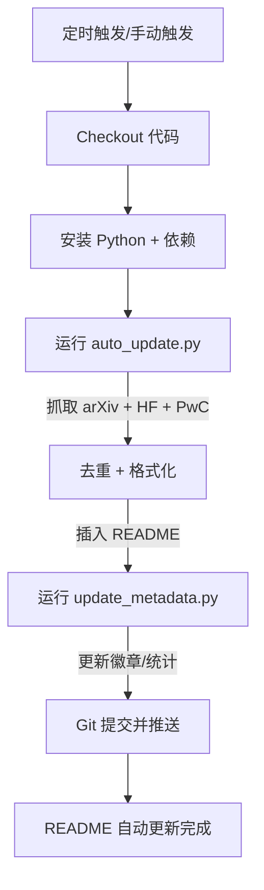

# GitHub Actions 配置指南

## 概述

本项目已内置自动化论文追踪系统，基于 GitHub Actions 每天自动从 arXiv、HuggingFace Papers 等源抓取最新论文并更新 README。

## 文件结构

```
.github/workflows/update-world-model.yml  # GitHub Actions 工作流定义
scripts/auto_update.py                   # 论文抓取脚本（arXiv + HF + PwC）
scripts/update_metadata.py               # 更新 README 徽章和统计数字
requirements.txt                         # Python 依赖
```

## 配置步骤

### 1. 推送到 GitHub（必须）

```bash
# 在本地项目目录执行
git remote add origin https://github.com/isLinXu/Awesome-Agent-World-Model.git
git branch -M main
git push -u origin main
```

### 2. 验证 Actions 权限

进入仓库 → **Settings** → **Actions** → **General**：

- ✅ **Workflow permissions** → 选择 **Read and write permissions**
- ✅ 勾选 **Allow GitHub Actions to create and approve pull requests**（可选）

**截图示意：**

```
Settings → Actions → General
├─ Actions permissions
│   ├─ ○ Disable Actions
│   ├─ ○ Enable local and third-party Actions
│   └─ ● Enable all Actions  ← 选这个
├─ Workflow permissions
│   ├─ ● Read repository contents and packages permissions
│   └─ ● Read and write permissions  ← 选这个
└─ [✓] Allow GitHub Actions to create and approve pull requests
```

### 3. 工作流已内置，无需额外配置

`.github/workflows/update-world-model.yml` 已经包含完整配置：

**触发方式：**

| 触发方式 | 说明 |
|---------|------|
| ⏰ **定时自动** | 每天 UTC 00:00（北京时间 08:00）自动运行 |
| 🖱️ **手动触发** | 仓库 → Actions → Update World Model Papers → Run workflow |

**手动运行步骤：**

1. 打开仓库页面
2. 点击 **Actions** 标签
3. 左侧选择 **Update World Model Papers**
4. 点击右侧 **Run workflow** 下拉按钮
5. 可选：输入日期范围和源（留空使用默认值）
6. 点击绿色 **Run workflow** 按钮

**参数说明（手动触发时）：**

| 参数 | 默认值 | 说明 |
|------|--------|------|
| `start_date` | 7 天前 | 开始日期 `YYYY-MM-DD` |
| `end_date` | 今天 | 结束日期 `YYYY-MM-DD` |
| `sources` | `arxiv,huggingface,paperswithcode` | 数据源，逗号分隔 |

### 4. 配置邮件通知（可选）

如果希望每次更新后收到邮件通知，添加步骤到 workflow：

```yaml
# 在 .github/workflows/update-world-model.yml 末尾添加：

      - name: Send email notification
        if: success()
        uses: dawidd6/action-send-mail@v3
        with:
          server_address: smtp.gmail.com
          server_port: 587
          username: ${{ secrets.EMAIL_USERNAME }}
          password: ${{ secrets.EMAIL_PASSWORD }}
          subject: "📚 Awesome-Agent-World-Model Daily Update"
          to: "your-email@example.com"
          from: "GitHub Actions"
          body: "README.md has been updated with new papers."
```

然后到 **Settings → Secrets and variables → Actions → New repository secret** 添加：

- `EMAIL_USERNAME`: 邮箱用户名
- `EMAIL_PASSWORD`: 邮箱密码或应用专用密码

## 工作流执行流程



## 常见问题

### Q: Actions 没有运行？

**检查清单：**
1. ✅ 文件是否已推送到 GitHub？`.github/workflows/update-world-model.yml` 必须存在于默认分支
2. ✅ Actions 是否启用？Settings → Actions → General
3. ✅ 定时任务首次触发可能需要等待到下一个 UTC 00:00

**强制手动触发测试：**
- 进入 Actions 页面 → 选择 workflow → Run workflow → 立即执行

### Q: 提交者是 "github-actions[bot]"？

这是正常的。GitHub Actions 使用内置的 `GITHUB_TOKEN` 进行认证，提交者显示为：

```
Author: github-actions[bot] <github-actions[bot]@users.noreply.github.com>
```

如需显示你的用户名，可以改用 Personal Access Token（PAT）：

```yaml
# 修改 workflow 中的 GITHUB_TOKEN:
env:
  GITHUB_TOKEN: ${{ secrets.PAT_TOKEN }}  # 使用 PAT 替代默认 TOKEN
```

然后在仓库 Settings → Secrets 中添加 `PAT_TOKEN`。

### Q: 每天更新太频繁？

修改定时触发频率（`.github/workflows/update-world-model.yml` 第 21 行）：

```yaml
# 每天（当前）
cron: "0 0 * * *"

# 每周一
cron: "0 0 * * 1"

# 每月 1 号
cron: "0 0 1 * *"
```

### Q: 只想手动运行，取消自动定时？

删除或注释掉 schedule 部分：

```yaml
on:
  workflow_dispatch:
    # ... 保留手动触发配置
  # schedule:
  #   - cron: "0 0 * * *"  # 注释掉这行
```

## 监控运行状态

1. 仓库 → **Actions** 标签页
2. 查看工作流运行历史（绿色 ✅ / 红色 ❌）
3. 点击任意运行记录查看详细日志

**日志位置：**

```
Actions → Update World Model Papers → [具体运行记录]
├─ Fetch new papers (multi-source)    ← arXiv/HF 抓取日志
├─ Update counts and metadata         ← 徽章更新日志
└─ Commit and push                    ← Git 提交日志
```

## 高级：多仓库同步

如果你有多个 awesome-list 项目，可以复用这套 Actions：

1. 复制 `.github/workflows/update-world-model.yml`
2. 复制 `scripts/auto_update.py` 和 `scripts/update_metadata.py`
3. 修改脚本中的 `SEARCH_QUERIES` 和 `SECTION_MAP` 匹配你的领域
4. 推送即可自动运行

---

**配置完成！** 推送后首次运行将在下一个 UTC 00:00 自动触发，或立即手动触发测试。
