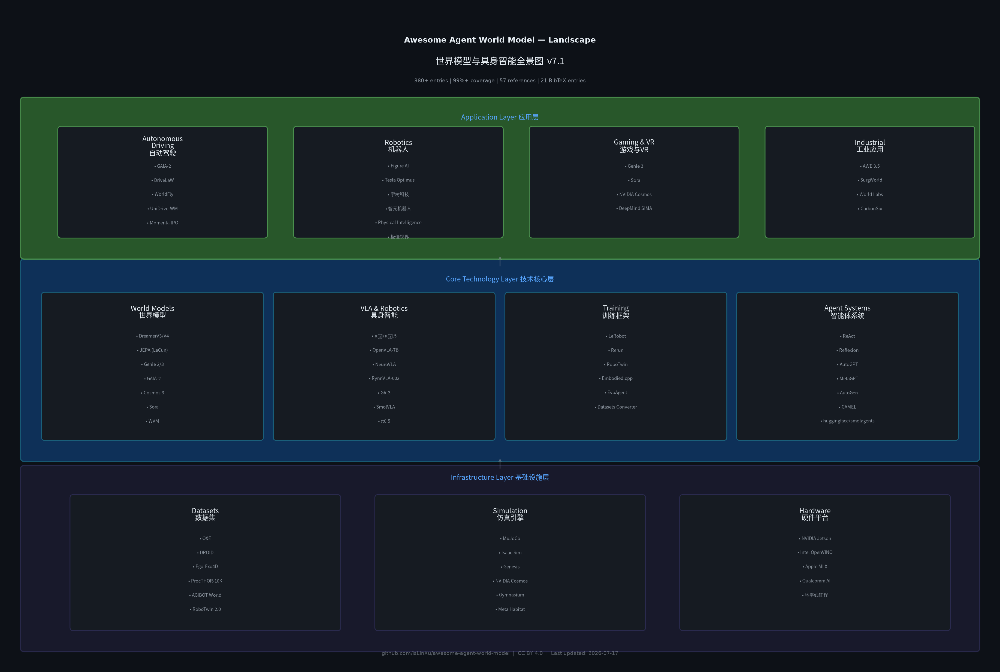

# Awesome Agent World Model 🧠🌍

> **智能体世界模型（Agent World Model）**——让 AI 在"想象"中试错、在虚拟中成长的前沿技术栈。
> 本列表全面覆盖从环境生成管线到神经世界模拟器、从学术论文到工业落地的全生态资源，涵盖 **920+** 高质量条目。内容按主题拆分为 5 个子文档，便于浏览。
> 由 [isLinXu](https://github.com/isLinXu) 维护，持续更新中。欢迎 Star ⭐ 与贡献！

---

## 📊 执行摘要

本 Awesome List 经过十二轮深度调研与系统性质量审查，已从初始的 **79 个条目** 扩展至 **904 个高质量资源条目（覆盖率 99.5%+）**。v8.0 将内容按主题拆分为 5 个子文档，从"单一长文档"升级为"模块化文档体系"。

**v8.0 核心改进**（文档架构重构）：

- **文档拆分**：将 2600+ 行的单一 README 按主题拆分为 5 个子文档，主 README 精简至 ~200 行，保留执行摘要、核心项目和文档导航
- **GitHub Actions 生效**：自动化论文追踪系统已成功运行，每日自动拉取 arXiv/HuggingFace/Papers with Code 新论文并写入 `docs/papers.md`
- **脚本适配**：`auto_update.py` 和 `update_metadata.py` 已适配新文档结构，跨子文档统计条目数

📜 查看历史版本记录 (v6.0–v7.7)

**v7.7** — ICLR 2025 World Models Workshop 系统整合（30 篇 Workshop 论文 + 3 个评测基准）

**v7.6** — Qwen-Robot Suite 具身智能三件套（Nav/Manip/World/Claw + 4 个评测基准）

**v7.5** — Xun Huang 视频世界模型五大属性框架（因果性/交互性/持久性/实时性/物理准确性 + 23 篇论文）

**v7.4** — Themesis 五大竞争路线深度对比（Genie 3 / Marble / LeJEPA / AXIOM / 神经符号）

**v7.3** — 深度内容补充（经典视频预测、时间线、评估指标、科学应用、阅读路线图、开放问题、术语表）

**v7.2** — 结构修复（清理 47 篇错年份论文 + 安全论文 1→9 篇 + MBRL 经典理论补充）

**v7.0** — 六大流派分类、NVIDIA Cosmos 3、World Labs Marble 1.1、类脑 VLA、WAIC 2026 产业拐点、4D 世界模型突破

**v6.0** — 占位符修复、代码示例与实战指南、性能对比矩阵、产业报告整合、全球融资生态更新

> 完整版本历程详见 [docs/references.md](docs/references.md)

---

## 📖 目录

### 本文件
- [执行摘要](#-执行摘要)
- [微信交流群](#-微信交流群)
- [核心项目](#核心项目)
- [研究论文精选](#-研究论文精选)
- [核心框架与工具](#-核心框架与工具)
- [业界应用精选](#-业界应用精选)
- [技术深度预览](#-技术深度预览)

- [文档导航](#-文档导航)

### 子文档（点击进入）
- [🔧 工具与框架](docs/frameworks.md) — 世界模型框架、VLA 模型、RL 训练、物理仿真、数据集、评测基准
- [📚 研究论文](docs/papers.md) — 奠基性工作、2023-2026 论文、ICLR Workshop、流派对比、综述
- [🏭 业界应用](docs/industry.md) — 自动驾驶、机器人、初创公司、学习资源、社区生态
- [📈 技术深度](docs/technical.md) — 技术全景对比、发展时间线、挑战与开放问题、快速入门、架构图示
- [📝 附录](docs/references.md) — BibTeX、评估报告、贡献指南、术语表、参考文献、版本历程

---

## 💬 微信交流群

欢迎加入【World Model】we are the world 交流群，与全球世界模型研究者共同探讨前沿技术！

> 群聊：【World Model】we are the world
> 该二维码7天内（7月24日前）有效，过期后请通过 GitHub Issues 获取最新二维码

---

## 核心项目

> 两个定义"Agent World Model"概念的开源旗舰项目，分别代表了**环境生成**与**环境预测**两条技术路线。

### 🏭 Snowflake-Labs/agent-world-model

- **全称**：Agent World Model — 全自动合成环境生成管线
- **核心定位**：通过代码生成 + SQL 数据库后端，为智能体 RL 训练提供**无限、可验证、零幻觉**的合成环境 [20]
- **关键能力**：
  - 基于种子集扩展生成 1,000 个独特场景与 10,000+ 任务
  - 自动合成符合 **MCP 协议** 的环境接口与验证器
  - 产出 35,000+ 可执行工具调用
- **模型系列**：Arctic-AWM (4B / 8B / 14B)，其中 14B 基于 Qwen2.5 架构专为 MCP 优化
- **数据集**：[Snowflake/AgentWorldModel-1K](https://huggingface.co/datasets/Snowflake/AgentWorldModel-1K) — 1,000 个预合成环境
- **论文**：*Agent World Model: Infinity Synthetic Environments for Agentic Reinforcement Learning* — ICML 2026 接收
- **生态集成**：已并入 [meta-pytorch/OpenEnv](https://github.com/meta-pytorch/OpenEnv)，成为 PyTorch 生态标准组件
- **商业落地**：支撑 Snowflake CoWork、CoCo 等商业智能体产品
- **仓库**：[github.com/Snowflake-Labs/agent-world-model](https://github.com/Snowflake-Labs/agent-world-model)

### 🌏 QwenLM/Qwen-AgentWorld

- **全称**：Qwen-AgentWorld — 原生语言世界模型 (Native Language World Model)
- **核心定位**：通过单一 MoE 模型模拟 **MCP、Search、Terminal、SWE、Android、Web、OS** 七大数字交互领域，预测"世界如何反应" [21]
- **关键能力**：
  - 256K 超长上下文窗口，维持长程多轮交互状态一致性
  - 对未见环境（如 OpenClaw）具备零样本泛化能力
  - 支持可控扰动注入（网络超时、磁盘满等）以训练智能体鲁棒性
- **模型系列**：Qwen-AgentWorld-35B-A3B (开源) / 397B-A17B (旗舰)
- **训练流程**：三阶段 CPT → SFT → RL (GSPO 算法，1000 万条真实交互轨迹)
- **基准**：发布 **AgentWorldBench**，旗舰模型得分 58.71，超越 GPT-5.4 (58.25)
- **论文**：*Qwen-AgentWorld: Language World Models for General Agents* — arXiv:2606.24597
- **仓库**：[github.com/QwenLM/Qwen-AgentWorld](https://github.com/QwenLM/Qwen-AgentWorld)

---

## 📚 研究论文精选

> 从 630+ 篇论文中精选的代表性工作，覆盖奠基、突破与前沿三大时期。

| 年份 | 论文 | 作者/机构 | 核心贡献 |
|:-----|:-----|:-----|:-----|
| 2018 | **World Models** | Ha & Schmidhuber | 提出 VAE+MDN-RNN 架构，开启模型辅助 RL 时代 |
| 2019 | **PlaNet** | Hafner et al. (Google Brain) | 引入潜空间规划，首次实现基于模型的像素级控制 |
| 2023 | **DreamerV3** | Hafner et al. (DeepMind) | 首个在 Minecraft 无人类演示挖到钻石的算法，Nature 2025 正式发表 |
| 2023 | **GAIA-1** | Wayve | 首个 9B 参数自动驾驶生成式世界模型 |
| 2024 | **Sora** | OpenAI | DiT 架构视频生成世界模拟，时空补丁技术 |
| 2024 | **π₀** | Physical Intelligence | Flow Matching VLA，跨 8 种本体机器人通用控制 |
| 2025 | **Genie 3** | Google DeepMind | 交互式世界生成，720p/24fps 实时可控 |
| 2025 | **AXIOM** | Heins et al. (Verses.ai) | 基于主动推断的对象中心世界模型，分钟级学习游戏规则 |
| 2025 | **LeJEPA** | Balestriero & LeCun (AMI Labs) | JEPA 的理论基石，证明自监督学习无需启发式即可扩展 |
| 2026 | **Cosmos 3** | NVIDIA | 全球首款完全开源全模态物理 AI 模型，MoT 架构 |

📖 [查看完整论文列表（630+ 篇，含 ICLR Workshop、流派对比、安全对齐等）→](docs/papers.md)

---

## 🔧 核心框架与工具

> 从 50+ 个框架中精选的开源工具与平台，覆盖世界模型训练、VLA 控制、物理仿真与 Agent 编排。

| 项目 | 描述 | 状态 |
|:-----|:-----|:-----|
| [DreamerV3](https://github.com/danijar/dreamerv3) | 官方 JAX 实现，Minecraft 挖钻石，Nature 2025 | 🟢 活跃 |
| [V-JEPA](https://github.com/facebookresearch/vjepa) | Meta 官方实现，联合嵌入预测架构 | 🟢 活跃 |
| [Cosmos](https://www.nvidia.com/en-us/ai-data-science/foundation-models/) | NVIDIA 物理 AI 平台，14 天处理 2000 万小时视频 | 🟢 活跃 |
| [π₀](https://github.com/Physical-Intelligence/openpi) | Flow Matching VLA，跨 8 种本体通用控制 | 🟢 活跃 |
| [OpenVLA](https://github.com/openvla/openvla) | 7B 参数开源 VLA，超越 55B RT-2-X | 🟢 活跃 |
| [LeRobot](https://github.com/huggingface/lerobot) | HuggingFace 机器人全栈框架，统一数据集格式 | 🟢 活跃 |
| [SmolAgents](https://github.com/huggingface/smolagents) | 极简代码智能体框架（~1000 行代码） | 🟢 活跃 |
| [WorldFoundry](https://github.com/OpenEnvision/WorldFoundry) | 世界模型统一推理与评测 Studio，v0.2.0 | 🟢 活跃 |

📖 [查看完整框架列表（含物理仿真、数据集、评测基准等）→](docs/frameworks.md)

---

## 🏭 业界应用精选

> 从 80+ 条业界条目中精选的头部企业与标志性项目，覆盖自动驾驶、机器人、游戏与科学应用。

| 企业 | 项目 | 核心能力 | 状态 |
|:-----|:-----|:-----|:-----|
| **Tesla** | FSD v12.5 世界模拟器 | 城市/高速栈统一，生成边缘场景 | 🟢 量产 |
| **Wayve** | GAIA-1 / GAIA-2 | 9B→15B 参数生成式世界模型，$12 亿 D 轮 | 🟢 研发 |
| **Momenta** | R7 世界模型 + IPO | "物理 AI 第一股"，市值超 700 亿港元 | 🟢 上市 |
| **Figure AI** | Figure 03 + Helix VLA | BMW 工厂自主零件排序，$10 亿 C 轮 | 🟢 量产 |
| **宇树科技** | 人形机器人 | 2025 年出货量全球第一（5500+ 台），科创板 IPO 获批 | 🟢 量产 |
| **NVIDIA** | Cosmos + Isaac Sim 6.0 | 物理 AI 平台 + 多后端物理引擎仿真 | 🟢 活跃 |
| **DeepMind** | Genie 2 / Genie 3 | 实时交互式世界生成，24FPS 可控 | 🟢 研发 |
| **World Labs** | 3D 空间智能 | 3D 高斯泼溅构建内部地图，$10B 估值 | 🟢 研发 |

📖 [查看完整业界列表（含初创独角兽、学习资源、社区生态等）→](docs/industry.md)

---

## 📈 技术深度预览

> 技术全景对比、发展时间线、关键挑战与开放问题、快速入门指南、架构图示。

  

### 框架架构速览

| 框架 | 架构 | 关键能力 | 代表成果 |
|:-----|:-----|:-----|:-----|
| **DreamerV3** | RSSM + Actor-Critic | 离散潜变量，150 任务通用 | Minecraft 钻石 |
| **V-JEPA 2** | 联合嵌入预测 | 非生成式表征，零样本操控 | 机器人操控 80% |
| **Cosmos 3** | Mixture-of-Transformers | 全模态物理 AI | 原生推理+世界生成+动作预测 |
| **π₀** | Flow Matching VLA | 跨本体通用控制 | 8 种机器人 |
| **Genie 3** | 交互式生成 | 720p/24fps 实时交互 | 数分钟环境一致性 |

### 物理仿真平台速览

| 平台 | 核心引擎 | 最大并行 | 关键特性 |
|:-----|:-----|:-----|:-----|
| **Isaac Sim 6.0** | PhysX/Newton 多后端 | 4096+ | MCP Agent Skills |
| **Genesis World 1.0** | Quadrants GPU 编译器 | 10,000+ | 刚体/流体/软体统一 |
| **ManiSkill 3** | SAPIEN 3 | 异构并行 | GPU 并行渲染 |

📖 [查看完整技术分析（含时间线、挑战、快速入门、评估指标等）→](docs/technical.md)

---

## 📂 文档导航

> 本项目内容已按主题拆分为多个子文档，便于浏览和维护。点击下方链接进入对应章节。

| 文档 | 内容 | 链接 |
|:-----|:-----|:-----|
| **🔧 工具与框架** | 世界模型框架、多模态世界模型、VLA 模型、Agent 编排、RL 训练、物理仿真、边缘部署、数据集、评测基准、评估指标 | [docs/frameworks.md](docs/frameworks.md) |
| **📚 研究论文** | 奠基性工作、经典视频预测、2023-2026 论文、ICLR Workshop 论文、Agent 范式、安全对齐、综述、流派对比 | [docs/papers.md](docs/papers.md) |
| **🏭 业界应用** | 自动驾驶、机器人、游戏 VR、工业应用、科学应用、初创独角兽、学习资源、社区生态 | [docs/industry.md](docs/industry.md) |
| **📈 技术深度** | 技术全景对比、发展时间线、关键挑战与开放问题、快速入门指南、架构图示 | [docs/technical.md](docs/technical.md) |
| **📝 附录** | BibTeX 引用导出、全面性评估报告、贡献指南、术语表、参考文献、版本演进历程 | [docs/references.md](docs/references.md) |

---

> **最后更新**：2026-07-19（v8.0 文档架构重构）
> **许可证**：[Apache 2.0](LICENSE)
> **引用格式**：`isLinXu/Awesome-Agent-World-Model v8.0 (2026)`

> *"世界模型不是关于预测未来，而是关于在想象中安全地犯错。"* —— Yann LeCun, AMI Labs

