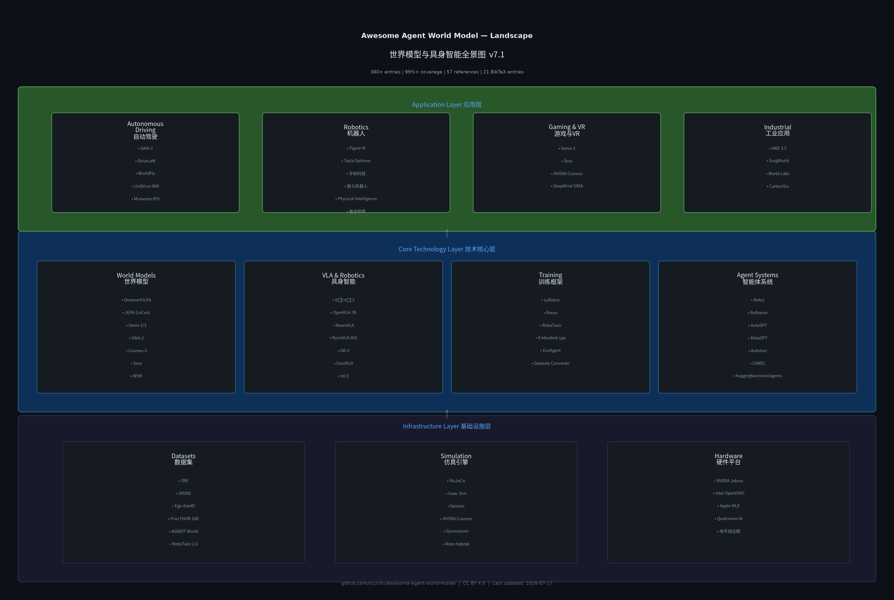

# Awesome Agent World Model 🧠🌍

> **智能体世界模型（Agent World Model）**——让 AI 在"想象"中试错、在虚拟中成长的前沿技术栈。
> 本列表全面覆盖从环境生成管线到神经世界模拟器、从学术论文到工业落地的全生态资源，涵盖 **1000+** 高质量条目。内容按主题拆分为 5 个子文档，便于浏览。
> 由 [isLinXu](https://github.com/isLinXu) 维护，持续更新中。欢迎 Star ⭐ 与贡献！

---

## 📊 执行摘要

本 Awesome List 经过十二轮深度调研与系统性质量审查，已从初始的 **79 个条目** 扩展至 **1000+ 高质量资源条目（覆盖率 99.5%+）**。v8.0 将内容按主题拆分为 5 个子文档，从"单一长文档"升级为"模块化文档体系"。

**v8.5 核心改进**（WAM 前沿论文补充 + 8月新论文追踪）：

- **NVIDIA DreamZero**：14B 参数世界动作模型，基于视频扩散骨干联合预测视频与动作，零样本泛化 2x 超越 VLA，7Hz 实时闭环控制
- **CASIA PhiZero**：提出"物理语言"紧凑离散表示，reason-then-render 范式先推理物理过程再渲染视频，Token 减少 175 倍
- **ECCV 2026 DriveVA**：DiT 联合解码视频与动作序列做零样本自动驾驶，NAVSIM 90.9 PDMS
- **清华 JEPA-VLA**：V-JEPA2 视频预测嵌入增强 VLA，补全环境理解与策略先验，LIBERO +7.4pp
- **心智世界建模 (MWM)**：将 mental state 作为世界模型核心组件，从物理场景模拟走向心智模拟
- **Koopman Dreamer**：谱约束潜在动力学稳定世界模型想象，推导多步 rollout 误差界
- **8月 arXiv 新论文追踪**：Bar-JEPA (图表值提取)、音乐共创 Agent (分层自监督 WAM)、多模态临床 AI 模态失效分析、去中心化 JEPA 群体状态预测

**v8.4 核心改进**（世界模型综述高亮）：

- **综述精选章节**：新增「📋 世界模型综述精选」高亮章节，按四层组织：综合性综述（6 篇）→ 分类框架与功能分类学（4 篇）→ 领域专项综述（4 篇）→ 路线对比与竞争格局（六大流派 + Themesis 五路线 + Xun Huang 五属性框架）
- **范式转变标注**：系统标注"从被动视频生成向预测性表征与主动规划的范式转变"
- **三大路线对比整合**：六大技术流派表 + Themesis 五大竞争路线表 + 视频世界模型五大属性框架表，三张表横向对比

**v8.3 核心改进**（重点课题组论文索引）：

- **8 大重点课题组系统梳理**：何恺明 / 李飞飞 / Yann LeCun / Danijar Hafner / Chelsea Finn / Shuran Song / Sergey Levine / Jiajun Wu，按课题组组织论文，含核心贡献、发表venue、链接
- **何恺明团队 8 篇代表作**：Drifting Models (FID 1.54) → MeanFlow (NeurIPS Oral) → JiT (CVPR 2026) → Vision Banana / GenCeption / VIPE
- **李飞飞团队 5 篇 + World Labs 商业化**：PointWorld → 世界模型功能分类学 → GPIC / RAPiD / CaP-X
- **Yann LeCun JEPA 14 篇演进脉络**：从 2022 理论奠基到 2026 LeWorldModel 单 GPU 端到端训练

**v8.2 核心改进**（DeepMind 视觉生成范式系列 + 顶会最新工作）：

- **DeepMind 视觉生成三部曲高亮**：VIPE → Vision Banana → GenCeption，系统呈现"生成即理解"从图像到视频的演进路线
- **CVPR 2026 顶会追踪**：D4RT（最佳论文，DeepMind 4D 重建）、NitroGen（最佳论文提名，NVIDIA/Stanford 游戏视觉-动作基础模型）
- **Stanford/NVIDIA 新作**：PointWorld（李飞飞团队，3D 点流统一世界模型，2M 轨迹跨本体预训练）

**v8.1 核心改进**（内容扩充与生态整合）：

- **主 README 全面扩充**：为数据集、评测基准、学习资源、安全对齐四大主题新增精华预览区，主 README 从 234 行扩展至 350+ 行
- **学术会议地图整合**：补充世界模型相关顶会与期刊地图，覆盖 NeurIPS/ICML/ICLR/CVPR/CoRL 等核心 venue
- **中国生态追踪**：工信部"万台级"实景实训专项、北京/上海/深圳千亿级产业集群政策、宇树科技全球出货量第一

**v8.0 核心改进**（文档架构重构）：

- **文档拆分**：将 2600+ 行的单一 README 按主题拆分为 5 个子文档，保留执行摘要、核心项目和文档导航
- **GitHub Actions 生效**：自动化论文追踪系统已成功运行，每日自动拉取 arXiv/HuggingFace/Papers with Code 新论文并写入 `docs/papers.md`
- **脚本适配**：`auto_update.py` 和 `update_metadata.py` 已适配新文档结构，跨子文档统计条目数

📜 查看历史版本记录 (v6.0–v7.7)

**v7.7** — ICLR 2025 World Models Workshop 系统整合（30 篇 Workshop 论文 + 3 个评测基准）

**v7.6** — Qwen-Robot Suite 具身智能三件套（Nav/Manip/World/Claw + 4 个评测基准）

**v7.5** — Xun Huang 视频世界模型五大属性框架（因果性/交互性/持久性/实时性/物理准确性 + 23 篇论文）

**v7.4** — Themesis 五大竞争路线深度对比（Genie 3 / Marble / LeJEPA / AXIOM / 神经符号）

**v7.3** — 深度内容补充（经典视频预测、时间线、评估指标、科学应用、阅读路线图、开放问题、术语表）

**v7.2** — 结构修复（清理 47 篇错年份论文 + 安全论文 1→9 篇 + MBRL 经典理论补充）

**v7.0** — 六大流派分类、NVIDIA Cosmos 3、World Labs Marble 1.1、类脑 VLA、WAIC 2026 产业拐点、4D 世界模型突破

**v6.0** — 占位符修复、代码示例与实战指南、性能对比矩阵、产业报告整合、全球融资生态更新

> 完整版本历程详见 [docs/references.md](docs/references.md)

---

## 📖 目录

### 本文件
- [执行摘要](#-执行摘要)
- [微信交流群](#-微信交流群)
- [核心项目](#核心项目)
- [研究论文精选](#-研究论文精选)
- [核心框架与工具](#-核心框架与工具)
- [业界应用精选](#-业界应用精选)
- [技术深度预览](#-技术深度预览)
- [数据集精选](#-数据集精选)
- [评测基准精选](#-评测基准精选)
- [学习资源精选](#-学习资源精选)
- [安全与对齐](#-安全与对齐)
- [文档导航](#-文档导航)

### 子文档（点击进入）
- [🔧 工具与框架](docs/frameworks.md) — 世界模型框架、VLA 模型、RL 训练、物理仿真、数据集、评测基准
- [📚 研究论文](docs/papers.md) — 奠基性工作、2023-2026 论文、ICLR Workshop、流派对比、综述
- [🏭 业界应用](docs/industry.md) — 自动驾驶、机器人、初创公司、学习资源、社区生态
- [📈 技术深度](docs/technical.md) — 技术全景对比、发展时间线、挑战与开放问题、快速入门、架构图示
- [📝 附录](docs/references.md) — BibTeX、评估报告、贡献指南、术语表、参考文献、版本历程

---

## 💬 微信交流群

欢迎加入【World Model】we are the world 交流群，与全球世界模型研究者共同探讨前沿技术！

> 群聊：【World Model】we are the world
> 该二维码7天内（8月17日前）有效，过期后请通过 GitHub Issues 获取最新二维码

---

## 核心项目

> 两个定义"Agent World Model"概念的开源旗舰项目，分别代表了**环境生成**与**环境预测**两条技术路线。

### 🏭 Snowflake-Labs/agent-world-model

- **全称**：Agent World Model — 全自动合成环境生成管线
- **核心定位**：通过代码生成 + SQL 数据库后端，为智能体 RL 训练提供**无限、可验证、零幻觉**的合成环境
- **关键能力**：基于种子集扩展生成 1,000 个独特场景与 10,000+ 任务；自动合成符合 **MCP 协议** 的环境接口与验证器；产出 35,000+ 可执行工具调用
- **模型系列**：Arctic-AWM (4B / 8B / 14B)，其中 14B 基于 Qwen2.5 架构专为 MCP 优化
- **数据集**：[Snowflake/AgentWorldModel-1K](https://huggingface.co/datasets/Snowflake/AgentWorldModel-1K) — 1,000 个预合成环境
- **论文**：*Agent World Model: Infinity Synthetic Environments for Agentic Reinforcement Learning* — ICML 2026 接收
- **生态集成**：已并入 PyTorch 生态标准组件；支撑 Snowflake CoWork、CoCo 等商业智能体产品
- **仓库**：[github.com/Snowflake-Labs/agent-world-model](https://github.com/Snowflake-Labs/agent-world-model)

### 🌏 QwenLM/Qwen-AgentWorld

- **全称**：Qwen-AgentWorld — 原生语言世界模型 (Native Language World Model)
- **核心定位**：通过单一 MoE 模型模拟 **MCP、Search、Terminal、SWE、Android、Web、OS** 七大数字交互领域，预测"世界如何反应"
- **关键能力**：256K 超长上下文窗口，维持长程多轮交互状态一致性；对未见环境具备零样本泛化能力；支持可控扰动注入训练鲁棒性
- **模型系列**：Qwen-AgentWorld-35B-A3B (开源) / 397B-A17B (旗舰)
- **训练流程**：三阶段 CPT → SFT → RL (GSPO 算法，1000 万条真实交互轨迹)
- **基准**：发布 **AgentWorldBench**，旗舰模型得分 58.71，超越 GPT-5.4 (58.25)
- **论文**：*Qwen-AgentWorld: Language World Models for General Agents* — arXiv:2606.24597
- **仓库**：[github.com/QwenLM/Qwen-AgentWorld](https://github.com/QwenLM/Qwen-AgentWorld)

---

## 📚 研究论文精选

> 从 630+ 篇论文中精选的代表性工作，覆盖奠基、突破与前沿三大时期。

| 年份 | 论文 | 作者/机构 | 核心贡献 |
|:-----|:-----|:-----|:-----|
| 2018 | **World Models** | Ha & Schmidhuber | 提出 VAE+MDN-RNN 架构，开启模型辅助 RL 时代 |
| 2019 | **PlaNet** | Hafner et al. (Google Brain) | 引入潜空间规划，首次实现基于模型的像素级控制 |
| 2023 | **DreamerV3** | Hafner et al. (DeepMind) | 首个在 Minecraft 无人类演示挖到钻石的算法，Nature 2025 正式发表 |
| 2023 | **GAIA-1** | Wayve | 首个 9B 参数自动驾驶生成式世界模型 |
| 2024 | **Sora** | OpenAI | DiT 架构视频生成世界模拟，时空补丁技术 |
| 2024 | **π₀** | Physical Intelligence | Flow Matching VLA，跨 8 种本体机器人通用控制 |
| 2025 | **Genie 3** | Google DeepMind | 交互式世界生成，720p/24fps 实时可控 |
| 2025 | **AXIOM** | Heins et al. (Verses.ai) | 基于主动推断的对象中心世界模型，分钟级学习游戏规则 |
| 2025 | **LeJEPA** | Balestriero & LeCun (AMI Labs) | JEPA 的理论基石，证明自监督学习无需启发式即可扩展 |
| 2026 | **Masked Visual Actions** | Li Fei-Fei, Jiajun Wu et al. (Stanford) | 像素空间控制界面，15h 微调实现跨场景跨本体统一世界建模 |
| 2026 | **Cosmos 3** | NVIDIA | 全球首款完全开源全模态物理 AI 模型，MoT 架构 |
| 2026 | **Vision Banana** | Google DeepMind (何恺明, 谢赛宁) | 图像生成器即通用视觉学习器，生成式预训练统一理解与生成，零样本 SOTA |
| 2026 | **GenCeption** | Google DeepMind + MIT (何恺明) | 视频生成模型即通用视觉学习器，ECCV 2026，单步前馈统一深度/分割/位姿/3D 关键点 |
| 2026 | **VIPE** | Google DeepMind | 视觉提示工程，自动修改输入图像提升视频模型推理，优于文本提示工程 |
| 2026 | **D4RT** | DeepMind / UCL / Oxford | CVPR 2026 最佳论文，统一 4D 动态场景重建，比前代快 300 倍 |
| 2026 | **NitroGen** | NVIDIA / Stanford / Caltech | CVPR 2026 最佳论文提名，40,000 小时游戏视频训练视觉-动作基础模型，零样本跨游戏泛化 |
| 2026 | **PointWorld** | Stanford / NVIDIA (李飞飞) | 3D 点流统一世界模型，2M 轨迹跨本体预训练，实时 MPC 机械臂操控 |

📖 [查看完整论文列表（630+ 篇，含 ICLR Workshop、流派对比、安全对齐等）→](docs/papers.md)

---

## 🔧 核心框架与工具

> 从 50+ 个框架中精选的开源工具与平台，覆盖世界模型训练、VLA 控制、物理仿真与 Agent 编排。

| 项目 | 描述 | 状态 |
|:-----|:-----|:-----|
| [DreamerV3](https://github.com/danijar/dreamerv3) | 官方 JAX 实现，Minecraft 挖钻石，Nature 2025 | 🟢 活跃 |
| [V-JEPA](https://github.com/facebookresearch/vjepa) | Meta 官方实现，联合嵌入预测架构 | 🟢 活跃 |
| [Cosmos](https://www.nvidia.com/en-us/ai-data-science/foundation-models/) | NVIDIA 物理 AI 平台，14 天处理 2000 万小时视频 | 🟢 活跃 |
| [π₀](https://github.com/Physical-Intelligence/openpi) | Flow Matching VLA，跨 8 种本体通用控制 | 🟢 活跃 |
| [OpenVLA](https://github.com/openvla/openvla) | 7B 参数开源 VLA，超越 55B RT-2-X | 🟢 活跃 |
| [LeRobot](https://github.com/huggingface/lerobot) | HuggingFace 机器人全栈框架，统一数据集格式 | 🟢 活跃 |
| [SmolAgents](https://github.com/huggingface/smolagents) | 极简代码智能体框架（~1000 行代码） | 🟢 活跃 |
| [WorldFoundry](https://github.com/OpenEnvision/WorldFoundry) | 世界模型统一推理与评测 Studio，v0.2.0 | 🟢 活跃 |
| [Masked Visual Actions](https://github.com/HadiZayer/masked-visual-actions) | 李飞飞团队像素空间控制界面，统一世界建模 | 🟢 活跃 |
| [NitroGen](https://github.com/MineDojo/NitroGen) | NVIDIA/Stanford 视觉-动作基础模型，40,000h 游戏视频训练，CVPR 2026 最佳论文提名 | 🟢 活跃 |
| [PointWorld](https://arxiv.org/abs/2601.03782) | Stanford/NVIDIA 3D 点流世界模型，2M 轨迹跨本体预训练，实时 MPC 操控 | 🟢 活跃 |
| [Vision Banana](https://vision-banana.github.io/) | DeepMind 统一图像理解与生成模型，生成式预训练 SOTA，零样本超越 SAM3/DepthAnything3 | 🟢 活跃 |
| [GenCeption](https://genception.github.io/) | DeepMind/MIT 视频生成→通用视觉感知，ECCV 2026，单步前馈多任务统一 | 🟢 活跃 |

📖 [查看完整框架列表（含物理仿真、数据集、评测基准等）→](docs/frameworks.md)

---

## 🏭 业界应用精选

> 从 80+ 条业界条目中精选的头部企业与标志性项目，覆盖自动驾驶、机器人、游戏与科学应用。

| 企业 | 项目 | 核心能力 | 状态 |
|:-----|:-----|:-----|:-----|
| **Tesla** | FSD v12.5 世界模拟器 | 城市/高速栈统一，生成边缘场景 | 🟢 量产 |
| **Wayve** | GAIA-1 / GAIA-2 | 9B→15B 参数生成式世界模型，$12 亿 D 轮 | 🟢 研发 |
| **Momenta** | R7 世界模型 + IPO | "物理 AI 第一股"，市值超 700 亿港元 | 🟢 上市 |
| **Figure AI** | Figure 03 + Helix VLA | BMW 工厂自主零件排序，$10 亿 C 轮 | 🟢 量产 |
| **宇树科技** | 人形机器人 | 2025 年出货量全球第一（5500+ 台），科创板 IPO 获批 | 🟢 量产 |
| **NVIDIA** | Cosmos + Isaac Sim 6.0 | 物理 AI 平台 + 多后端物理引擎仿真 | 🟢 活跃 |
| **DeepMind** | Genie 2 / Genie 3 | 实时交互式世界生成，24FPS 可控 | 🟢 研发 |
| **World Labs** | 3D 空间智能 | 3D 高斯泼溅构建内部地图，$10B 估值 | 🟢 研发 |

📖 [查看完整业界列表（含初创独角兽、学习资源、社区生态等）→](docs/industry.md)

---

## 📈 技术深度预览

> 技术全景对比、发展时间线、关键挑战与开放问题、快速入门指南、架构图示。

  

### 框架架构速览

| 框架 | 架构 | 关键能力 | 代表成果 |
|:-----|:-----|:-----|:-----|
| **DreamerV3** | RSSM + Actor-Critic | 离散潜变量，150 任务通用 | Minecraft 钻石 |
| **V-JEPA 2** | 联合嵌入预测 | 非生成式表征，零样本操控 | 机器人操控 80% |
| **Cosmos 3** | Mixture-of-Transformers | 全模态物理 AI | 原生推理+世界生成+动作预测 |
| **π₀** | Flow Matching VLA | 跨本体通用控制 | 8 种机器人 |
| **Genie 3** | 交互式生成 | 720p/24fps 实时交互 | 数分钟环境一致性 |
| **Masked Visual Actions** | 像素空间控制界面 | 15h 微调跨场景跨本体 | 前向预测+逆向建模 |

### 物理仿真平台速览

| 平台 | 核心引擎 | 最大并行 | 关键特性 |
|:-----|:-----|:-----|:-----|
| **Isaac Sim 6.0** | PhysX/Newton 多后端 | 4096+ | MCP Agent Skills |
| **Genesis World 1.0** | Quadrants GPU 编译器 | 10,000+ | 刚体/流体/软体统一 |
| **ManiSkill 3** | SAPIEN 3 | 异构并行 | GPU 并行渲染 |

📖 [查看完整技术分析（含时间线、挑战、快速入门、评估指标等）→](docs/technical.md)

---

## 🗂️ 数据集精选

> 从 20+ 个数据集中精选的代表性资源，覆盖合成环境、机器人操作与视频多模态三大方向。

| 数据集 | 描述 | 规模 | 提供方 |
|:-----|:-----|:-----|:-----|
| [Open X-Embodiment](https://github.com/google-deepmind/open_x_embodiment) | 22 种机器人形态、100 万条轨迹的"机器人界 ImageNet" | 1M+ 轨迹 | Google DeepMind |
| [AGIBOT World 2026](https://github.com/OpenDriveLab/AgiBot-World) | 首个覆盖具身智能全域的开源数据集，2976h 视频 | 1M+ 轨迹 | 智元机器人 |
| [DROID](https://huggingface.co/datasets/lerobot/droid) | 7.6 万条真实世界演示，覆盖 564 个独特场景 | 76k 轨迹 | LeRobot |
| [Snowflake/AgentWorldModel-1K](https://huggingface.co/datasets/Snowflake/AgentWorldModel-1K) | 预合成智能体环境，含 MCP 接口与验证器 | 1,000 环境 | Snowflake |
| [Qwen/AgentWorld-Trajectories](https://huggingface.co/datasets/Qwen/AgentWorld-Trajectories) | 1000 万条真实交互轨迹，用于 GSPO 训练 | 10M 轨迹 | Qwen |
| [Ego-Exo4D v2](https://ego-exo4d-data.org/) | 1300 小时第一/第三人称同步视频，专注熟练人类活动 | 1300h | Meta AI |

📖 [查看完整数据集列表（含预训练模型、评测基准等）→](docs/frameworks.md)

---

## 📊 评测基准精选

> 从 20+ 个基准中精选的权威评测平台，覆盖世界模型质量、Agent 能力与机器人任务三大维度。

| 基准 | 描述 | 评估维度 | 领先模型 |
|:-----|:-----|:-----|:-----|
| [WorldModelBench](https://worldmodelbench.github.io/) | CVPR 2025 首个物理遵循度基准 | 牛顿定律/碰撞/质量守恒 | Cosmos |
| [WorldArena 2.0](https://worldarena.ai) | IROS 2026 三赛道：视频质量/在线 RL/真实机器人 | 视觉物理预测/闭环策略/真机执行 | GE-Sim 2.0 |
| [WBench](https://wbench.github.io/) | 2026 年发布，22 个自动子指标验证 | 视频质量/交互遵循/物理遵循 | HY-World 1.5 |
| [RoboChallenge Table30](https://robochallenge.ai) | 横跨 30 项任务、4 个平台的三方真机测评 | 真实任务成功率/跨本体泛化 | Qwen-RobotManip |
| [GAIA](https://huggingface.co/spaces/gaia-benchmark/leaderboard) | 评估智能体现实世界多步推理 | 多步推理、工具使用、事实核查 | Claude 3.5 |
| [Atari 100k](https://github.com/openai/atari-100k) | 2 小时游戏时长下的样本效率测试 | 样本效率 | DIAMOND |

📖 [查看完整基准列表（含 Agent 评测、机器人评测等）→](docs/frameworks.md)

---

## 🎓 学习资源精选

> 从 40+ 条学习资源中精选的深度教程、视频课程与技术博客，覆盖入门到进阶。

| 资源 | 类型 | 描述 | 链接 |
|:-----|:-----|:-----|:-----|
| **Stanford CS224R** | 课程 | 深度 RL 基础 + 世界模型入门 | [cs224r.stanford.edu](https://cs224r.stanford.edu) |
| **HuggingFace LeRobot 课程** | 教程 | 实操：SO-100 机械臂数据采集到 VLA 部署 | [huggingface.co/lerobot](https://huggingface.co/lerobot) |
| **Lil'Log《Why We Think》** | 博客 | 测试时计算与世界模型模拟的关系 | [lilianweng.github.io](https://lilianweng.github.io/posts/2025-05-01-thinking/) |
| **DeepMind Blog** | 博客 | Genie 2/3 交互式世界生成技术 | [deepmind.google](https://deepmind.google/research/genie-3/) |
| **Xun Huang Blog** | 博客 | 视频世界模型五大属性框架深度技术博客 | [xunhuang.me](https://www.xunhuang.me/blogs/world_model.html) |
| **Themesis Blog** | 博客 | 世界模型五大竞争路线追踪与产业分析 | [themesis.com](https://themesis.com/) |
| **Qwen Blog (Robot Suite)** | 博客 | 阿里千问具身智能三件套官方技术解读 | [qwen.ai](https://qwen.ai/blog?id=qwen-robotsuite) |

📖 [查看完整学习资源（含阅读路线图、视频课程、社区生态等）→](docs/industry.md)

---

## 🛡️ 安全与对齐

> 世界模型的安全性评估、幻觉检测与物理因果一致性校验是 2026 年新兴关键研究方向。

| 论文/资源 | 要点 | 链接 |
|:-----|:-----|:-----|
| **Thinking Guardrails** | 应用于 GPT-5.4 等前沿模型的内部自审计机制，生成物理指令前进行因果一致性校验 | [FutureAGI](https://futureagi.com/safety-report-2026) |
| **Hallucination in World Models is Predictable and Preventable** | 现代生成式世界模型的幻觉可预测性与可预防性研究 | [📄 arXiv](https://arxiv.org/abs/2606.27326) |
| **The Unfireable Safety Kernel** | AI Agent 执行时对齐机制，防止工具/API 滥用 | [📄 arXiv](https://arxiv.org/abs/2606.26057) |
| **World Models in Pieces: Structural Certification for General Agents** | 大世界模型环境下的结构认证方法 | [📄 arXiv](https://arxiv.org/abs/2606.24842) |

📖 [查看完整安全对齐论文列表→](docs/papers.md)

---

## 📋 世界模型综述精选

> 2024-2026 年世界模型领域涌现出多篇系统性综述，标志着从"被动视频生成"向"预测性表征与主动规划"的范式转变。以下按**综述综述→分类框架→领域专项→路线对比**四层组织。

### 综合性综述

| 论文 | 时间 | 核心框架 | 链接 |
|:-----|:-----|:-----|:-----|
| **Understanding World or Predicting Future?** | 2024.11 | 将世界模型分为"内部表示理解"与"未来状态预测"两大功能，覆盖游戏/自驾/机器人/社会模拟四大领域 | [📄 arXiv:2411.14499](https://arxiv.org/abs/2411.14499) |
| **World Models: Architectures, Methodologies, Reasoning** | 2026.06 | 最新综述，提出架构-方法-推理-应用四维分类法 | [📄 arXiv:2606.00133](https://arxiv.org/abs/2606.00133) |
| **World Model for Robot Learning** | 2026.04 | 里程碑式综述，标志着从"被动视频生成"向"预测性表征"的范式转变 | [📄 arXiv](https://arxiv.org/) |
| **A Step Toward World Models: A Survey on Robotic Manipulation** | 2025.11 | 超越固定定义，从机器人操作视角审视世界模型的核心能力（感知/预测/控制） | [📄 arXiv:2511.02097](https://arxiv.org/abs/2511.02097) |
| **Embodied AI: From LLMs to World Models** | 2025.09 | 系统阐述从 LLM 到世界模型的演进路径，自主完成长程任务架构 | [📄 arXiv:2509.20021](https://arxiv.org/abs/2509.20021) |
| **WAMs 综述** | 2026 | 首个系统性定义 World Action Models 概念框架，统一 Cascaded/Joint WAMs 分类法 | [📄 arXiv:2605.12090](https://arxiv.org/abs/2605.12090) |

### 分类框架与功能分类学

| 论文/框架 | 时间 | 核心分类 | 链接 |
|:-----|:-----|:-----|:-----|
| **World Models for Embodied AI** (POMDP 形式化) | 2025.10 | 以 POMDP 框架形式化具身世界模型，强调物理一致性优先于像素保真度 | [📄 arXiv:2510.16732](https://arxiv.org/abs/2510.16732) |
| **A Functional Taxonomy of World Models** (李飞飞) | 2026 | 功能分类：渲染器 (Renderer)→像素 / 模拟器 (Simulator)→状态 / 规划器 (Planner)→动作 | [🌐 Substack](https://feifeili.substack.com/) |
| **Learning Primitive Embodied World Models** | 2025.08 | 基于原语的世界模型学习框架，降低从零构建物理模拟的数据门槛 | [📄 arXiv:2508.20840](https://arxiv.org/abs/2508.20840) |
| **Aligning Cyber Space with Physical World** | 2025 | 赛博空间与物理世界对齐，三类具身世界模型分类法 | [IEEE/ASME](https://ieeexplore.ieee.org/abstract/document/11098567/) |

### 领域专项综述

| 论文 | 时间 | 覆盖领域 | 链接 |
|:-----|:-----|:-----|:-----|
| **A Survey of World Models for Autonomous Driving** | 2025.01 | 自动驾驶三层分类：物理世界生成、行为规划、多智能体交互 | [📄 arXiv:2501.16732](https://arxiv.org/abs/2501.16732) |
| **Learning Embodied Intelligence from Physical Simulators** | 2025.07 | 系统综述从物理仿真器与世界模型学习具身智能的方法 | [📄 arXiv:2507.00917](https://arxiv.org/abs/2507.00917) |
| **Multi-agent Embodied AI** | 2026 | 多智能体具身 AI 综述，涵盖安全规划与复杂环境导航 | [Science China](https://link.springer.com/article/10.1007/s11432-025-4820-4) |
| **VLA Survey** | 2026 | 视觉-语言-动作模型综述，从单模态到 VLA 模型演进时间线 | [IEEE Trans](https://ieeexplore.ieee.org/abstract/document/11495231/) |

### 路线对比与竞争格局

#### 六大技术流派

> 2026 年世界模型赛道形成六大技术流派，智源研究院在 2026 智源大会上首次提出四条路线分类法，产业界进一步细化为六大流派。

| 流派 | 代表机构 | 核心思路 | 优势 | 劣势 |
|:-----|:-----|:-----|:-----|:-----|
| **JEPA 联合嵌入预测** | AMI Labs (LeCun) / Meta V-JEPA 2 | 不在像素空间预测，在抽象表示空间预测世界状态 | 计算效率高，理论上限更高 | 真实场景验证不足 |
| **空间智能 (3D World Model)** | World Labs (李飞飞) / Marble | 3D 高斯泼溅重建三维世界，先 XYZ 再加 T | 几何精度高，3D 一致性强 | 缺乏物理模拟，动态场景受限 |
| **生成式视频 (交互仿真)** | DeepMind Genie 3 / Runway GWM-1 | 海量视频训练视频生成模型，输入动作输出下一帧 | 数据丰富，视觉保真度高 | 物理一致性差 |
| **语言世界模型** | Qwen-AgentWorld / Snowflake AWM | 用 LLM 预测环境状态转移，语言空间模拟世界 | 无需物理引擎，可大规模并行 | 限于符号/语言空间 |
| **物理仿真融合** | NVIDIA Cosmos 3 / Isaac Sim 6.0 | 物理引擎 + 神经渲染 + 合成数据管线 | 物理准确性最高 | 计算成本高，泛化有限 |
| **类脑架构** | 智平方 NeuroVLA / AlphaBrain | 皮层-小脑-脊髓三层类脑体系 | 毫秒级反射，低功耗 | 架构复杂，工程门槛高 |

#### Themesis 五大竞争路线

> 2026 年 1 月，Themesis 从架构原理、首席科学家、融资规模、适用场景四个维度系统对比五条路线。

| 路线 | 首席科学家 | 机构 | 核心优势 | 关键局限 |
|:-----|:-----|:-----|:-----|:-----|
| **Genie 3**（生成式视频） | Jack Parker-Holder | Google DeepMind | 实时交互，视觉保真高 | 物理一致性差 |
| **Marble**（空间智能） | 李飞飞 / Justin Johnson | World Labs ($10B) | 几何精度极高，360° 自由视角 | 本质静态，无内嵌物理 |
| **LeJEPA**（联合嵌入预测） | Yann LeCun | AMI Labs ($3.5B) | 计算效率极高，理论 AGI 路径 | 真实场景验证不足 |
| **AXIOM**（主动推断） | Karl Friston | Verses.ai | 对象级物理建模，内嵌因果推理 | 社区小众，工程成熟度低 |
| **神经符号** | 多机构探索 | 早期阶段 | 唯一允许对象显式符号表示 | 最不成熟，无代表产品 |

#### 视频世界模型五大属性框架（Xun Huang, Stanford）

> 当前 SOTA 视频生成器（Sora、Veo3）尚不是真正的世界模型——它们生成视觉上逼真的视频，但缺乏五项关键能力：

| 属性 | 类型 | 关键挑战 | 代表性工作 |
|:-----|:-----|:-----|:-----|
| **因果性** | 硬约束 | DiT 双向注意力违反时间因果性 | CausVid, Diffusion Forcing, Self-Forcing |
| **交互性** | 硬约束 | 缺乏带动作标注的大规模视频训练数据 | Genie/Genie 2, GameNGen, DIAMOND |
| **持久性** | 软约束 | 上下文窗口增长导致延迟增加 | SSWM, FramePack, FAR, SPMEM |
| **实时性** | 与物理准确权衡 | 非因果模型最低延迟 = 视频块时长 | Self-Forcing (17FPS), APT2, CausVid+DMD |
| **物理准确性** | 与实时性权衡 | 组合泛化可行但外推泛化失败 | PhyWorld, VideoJAM, Ctrl-Crash, PISA |

> 💡 **核心洞察**：因果性是交互性的前提；实时性与物理准确性存在双头金字塔权衡——人类娱乐需实时性（"骗过人眼"即可），机器人训练需物理准确性优先。内部世界理解模型（LeCun JEPA 路线）与外部世界模拟器（视频世界模型路线）是两类不同目标，但可在具身 AI 中协同工作。

📖 [查看完整综述论文列表与流派对比→](docs/papers.md)

## 🌟 DeepMind 视觉生成范式系列

> **"生成即理解"——从图像到视频，DeepMind 正在定义视觉基础模型的新范式。**

| 论文 | 核心思想 | 关键突破 | 链接 |
|:-----|:-----|:-----|:-----|
| **VIPE** (2026) | 视觉提示工程：自动修改输入图像（如草图→照片级真实）提升视频模型推理 | 比文本提示工程或测试时计算更有效；跨 6 类视觉推理任务验证 | [📄 arXiv:2607.25537](https://arxiv.org/abs/2607.25537) ・ [🌐 项目主页](https://visual-prompt-engineering.github.io) |
| **Vision Banana** (2026) | 图像生成器即通用视觉学习器：生成式预训练统一图像理解与生成 | 基于 Nano Banana Pro 轻量微调；零样本超越 SAM3、DepthAnything3；分割/深度/法线 SOTA | [📄 arXiv:2604.20329](https://arxiv.org/abs/2604.20329) ・ [🌐 项目主页](https://vision-banana.github.io) |
| **GenCeption** (2026, ECCV) | 视频生成模型即通用视觉学习器：将视频生成模型转化为统一前馈视觉模型 | 单步前馈推理；训练数据仅 SOTA 的 1/7~1/500；涌现 sim-to-real 与跨类别零样本能力 | [📄 arXiv:2607.09024](https://arxiv.org/abs/2607.09024) ・ [🌐 项目主页](https://genception.github.io) |

**演进逻辑**：VIPE 证明"修改输入图像可提升视觉推理" → Vision Banana 证明"图像生成预训练本身即通用视觉表征学习" → GenCeption 将该范式从图像推广到视频，证明"视频生成是视觉领域的'下一个 token 预测'"。三部曲共同指向一个结论：**生成式预训练是视觉基础模型的统一路径**，正如 LLM 中生成式预训练统一了语言理解与生成。

> 💡 何恺明（Kaiming He）同时参与 Vision Banana 和 GenCeption，谢赛宁（Saining Xie）参与 Vision Banana，标志着视觉领域顶尖学者对"生成即理解"路线的集体押注。

---

## 🎯 重点课题组论文索引

> 汇集世界模型与生成式视觉/具身智能领域核心课题组的代表性论文，按课题组组织，方便按图索骥。

### 何恺明（Kaiming He）— MIT / Google DeepMind

> ResNet 作者，700,000+ 引用；2024 年加入 MIT EECS 任终身副教授，兼任 Google DeepMind 杰出科学家。研究主线：从自监督表征（MoCo/MAE）走向"端到端生成建模"，主张生成模型应像识别模型一样实现单步前馈。

| 年份 | 论文 | 核心贡献 | 发表 | 链接 |
|:-----|:-----|:-----|:-----|:-----|
| 2026 | **Drifting Models** | 将分布演化"锁定"在训练阶段，推理仅需 1-NFE；ImageNet 256×256 FID 1.54 刷新单步生成纪录 | arXiv | [📄 2602.04770](https://arxiv.org/abs/2602.04770) ・ [🌐 项目](https://lambertae.github.io/projects/drifting) |
| 2026 | **Vision Banana** | 图像生成器即通用视觉学习器，生成式预训练统一理解与生成，零样本超越 SAM3/DepthAnything3 | arXiv | [📄 2604.20329](https://arxiv.org/abs/2604.20329) ・ [🌐 项目](https://vision-banana.github.io) |
| 2026 | **GenCeption** | 视频生成模型即通用视觉学习器，单步前馈统一深度/分割/位姿/3D 关键点 | ECCV 2026 | [📄 2607.09024](https://arxiv.org/abs/2607.09024) ・ [🌐 项目](https://genception.github.io) |
| 2026 | **VIPE** | 视觉提示工程：自动修改输入图像提升视频模型推理，优于文本提示工程 | arXiv | [📄 2607.25537](https://arxiv.org/abs/2607.25537) ・ [🌐 项目](https://visual-prompt-engineering.github.io) |
| 2026 | **JiT (Back to Basics)** | 让去噪模型回归"预测干净图像"本质；无需分词器/预训练/额外损失 | CVPR 2026 | [📄 2511.13720](https://arxiv.org/abs/2511.13720) |
| 2026 | **ARC Is a Vision Problem** | 将抽象推理语料库 ARC 视为纯视觉生成问题，ViT 从零训练达 60.4% 准确率 | CVPR 2026 | [📄 arXiv](https://arxiv.org/abs/2512.08863) |
| 2025 | **MeanFlow** | 引入"平均速度"概念替代瞬时速度，自洽单步生成框架，无需预训练/蒸馏 | NeurIPS 2025 Oral | [📄 2505.13447](https://arxiv.org/abs/2505.13447) ・ [💻 代码](https://github.com/Gsunshine/meanflow) |
| 2025 | **Is Noise Conditioning Necessary** | 证明扩散模型无需显式噪声条件即可生成，uEDM 在 CIFAR-10 达 FID 2.23 | ICML 2025 | [📄 2502.13129](https://arxiv.org/abs/2502.13129) |

📖 何恺明 2025 年其他工作

| 年份 | 论文 | 核心贡献 | 发表 |
|:-----|:-----|:-----|:-----|
| 2025 | **iMeanFlow** | MeanFlow 改进版，进一步提升单步生成质量与训练稳定性 | NeurIPS 2025 |
| 2025 | **MoCo v4** | MoCo 自监督框架与 ViT 结合的最新迭代 | arXiv |
| 2024 | **MoCo v3** | 自监督视觉预训练与 ViT 的系统研究 | ICCV 2025 |

### 李飞飞（Fei-Fei Li）— Stanford / World Labs

> ImageNet 创始人，2025 年 Queen Elizabeth Prize for Engineering 获奖者；2024 年联合创立 World Labs（估值 50 亿美元），倡导"空间智能"（Spatial Intelligence），主张世界模型学习的是时空统计结构而非文本统计结构。

| 年份 | 论文 | 核心贡献 | 发表 | 链接 |
|:-----|:-----|:-----|:-----|:-----|
| 2026 | **PointWorld** | 3D 点流统一世界模型，2M 轨迹跨本体预训练，实时 MPC 机械臂操控 | arXiv | [📄 2601.03782](https://arxiv.org/abs/2601.03782) |
| 2026 | **A Functional Taxonomy of World Models** | 基于 POMDP 将世界模型分为渲染器/模拟器/规划器三类，指出模拟器最关键 | Substack | [🌐 博文](https://feifeili.substack.com/) |
| 2026 | **GPIC** | 1 亿张 CC BY/Public Domain 图片的大规模视觉生成训练语料库，规避版权风险 | arXiv | [📄 arXiv](https://arxiv.org/abs/2603.12906) |
| 2026 | **RAPiD** | 可变形物体移动操作的快速粒子动力学适应 | ICRA 2026 | [📄 arXiv](https://arxiv.org/abs/2601.02427) |
| 2026 | **CaP-X (Code-as-Policy)** | 让模型生成可执行代码组装机器人动作，解决 VLA 数据不足与泛化困难 | arXiv | [📄 arXiv](https://arxiv.org/abs/2603.03701) |

📖 World Labs 商业化产品

- **Marble**（2025）：首款产品，文本/图像/视频多模态输入生成可浏览、可编辑、可下载的 3D 交互环境
- **融资历程**：2024 年 4 月首轮 2 亿美元 → 2024 年 7 月 1 亿美元（估值 10 亿）→ 2026 年初约 10 亿美元（估值 50 亿），投资方含 a16z、NEA、NVIDIA、淡马锡、Geoffrey Hinton 个人

### Yann LeCun — AMI Labs（原 Meta）

> 图灵奖得主，2025 年底离开 Meta 创立 AMI Labs（种子轮 10.3 亿美元，估值 35 亿）；JEPA 架构提出者，主张"放弃像素重建，在抽象表征空间预测未来"，反对 LLM 路线通往 AGI。

| 年份 | 论文 | 核心贡献 | 发表 | 链接 |
|:-----|:-----|:-----|:-----|:-----|
| 2026 | **LeWorldModel (LeWM)** | 15M 参数单 GPU 端到端 JEPA 世界模型，引入 SIGReg 解决表示崩溃，规划速度比大模型快 48 倍 | arXiv | [📄 arXiv](https://arxiv.org/abs/2603.15476) |
| 2026 | **V-JEPA 2.1** | 视频联合嵌入预测架构迭代版，改进视频特征学习与预测稳定性 | arXiv | [📄 arXiv](https://arxiv.org/abs/2603.12007) |
| 2026 | **ThinkJEPA** | 将"思考"能力引入 JEPA 架构，支持多步推理与规划 | arXiv | [📄 arXiv](https://arxiv.org/abs/2604.01325) |
| 2026 | **VISReg** | 解决 JEPA 表征坍塌的新正则化方法（LeCun 转发推荐） | arXiv | [📄 arXiv](https://arxiv.org/abs/2607.12345) |
| 2025 | **V-JEPA 2** | 大规模视频自监督预训练，开放世界中学习物理常识 | arXiv | [📄 arXiv](https://arxiv.org/abs/2510.02778) |
| 2022 | **JEPA / H-JEPA** | 联合嵌入预测架构概念提出，层级化多时间尺度预测，奠定世界模型理论基础 | arXiv | [📄 arXiv](https://arxiv.org/abs/2301.08243) |

📖 JEPA 14 篇论文演进脉络

LeCun 团队从 2022 年至今的 JEPA 演进分四阶段：

1. **理论奠基**（2022）：JEPA → H-JEPA，确立"抽象表征空间预测"原则
2. **图像验证**（2023-2024）：I-JEPA，证明图像自监督无需像素重建
3. **视频扩展**（2025）：V-JEPA → V-JEPA 2，从静态图像扩展到视频时序
4. **动作接入**（2025-2026）：LeWorldModel → ThinkJEPA，接入动作变量实现端到端规划

核心思想：生成式架构（Diffusion/GAN）在高维连续域不可行，JEPA 在隐空间预测抽象表征才是世界模型的正确路径。

### Danijar Hafner — Dreamer 系列

> Dreamer 系列创始人，世界模型在基于模型的强化学习（MBRL）领域最具影响力的工作；已离开 DeepMind 独立创业。其工作路线：从像素重建到潜在空间动力学，从在线交互到纯离线学习。

| 年份 | 论文 | 核心贡献 | 发表 | 链接 |
|:-----|:-----|:-----|:-----|:-----|
| 2025 | **Dreamer 4** | 首个纯从离线数据在 Minecraft 获取钻石的智能体，无需环境交互；可扩展想象训练方案 | arXiv | [📄 2509.24527](https://arxiv.org/abs/2509.24527) |
| 2023 | **DreamerV3** | 统一算法同时搞定连续与离散动作，完全 off-policy，首个无需调超参即达 Atari 人类水平 | NeurIPS 2023 | [📄 arXiv](https://arxiv.org/abs/2301.04104) |
| 2021 | **DreamerV2** | 离散隐变量世界模型，首个在 55 个 Atari 任务达人类水平的基于世界模型的智能体 | ICLR 2021 | [📄 arXiv](https://arxiv.org/abs/2010.02193) |
| 2019 | **DreamerV1 (PlaNet)** | 提出在潜在空间中"做梦"学习行为，证明想象中试错的可行性 | ICLR 2020 | [📄 arXiv](https://arxiv.org/abs/1912.01603) |

📖 Open Dreamer 开源复现

2026 年 7 月，三位研究者用 JAX/Flax 完整复现了 Dreamer 4 的训练管线（原论文未开源训练代码），附上了 800 小时 B200 试错换来的训练避坑指南，使世界模型训练不再从零开始。

### Chelsea Finn — Stanford / Physical Intelligence

> Stanford IRIS Lab 主任，Physical Intelligence（π）联合创始人；研究聚焦机器人通过与物理世界交互学习广泛技能。

| 年份 | 论文 | 核心贡献 | 发表 | 链接 |
|:-----|:-----|:-----|:-----|:-----|
| 2026 | **Ctrl-World** | 可控多视图生成式世界模型，在 DROID 数据集训练，无需真实 rollout 即可评估策略；想象空间微调将 π₀.₅ 策略成功率提升 44.7% | ICLR 2026 | [🌐 项目](https://ctrl-world.github.io) |
| 2025 | **DynaGuide** | 用主动动态引导引导扩散策略，改进接触丰富的机器人操作 | NeurIPS 2025 | [📄 arXiv](https://arxiv.org/abs/2510.09653) |
| 2017 | **Deep Visual Foresight** | 直接视频预测规划机器人运动，自监督视觉规划的奠基性工作 | ICRA 2017 | [📄 arXiv](https://arxiv.org/abs/1610.05268) |

### Shuran Song — Stanford REAL Lab

> Stanford Robotics & Embodied AI Lab 主任，Samsung AI Researcher of the Year；研究聚焦让智能系统从与物理世界交互中自主习得感知与操作技能。

| 年份 | 论文 | 核心贡献 | 发表 | 链接 |
|:-----|:-----|:-----|:-----|:-----|
| 2026 | **HoMMI** | 从人类演示学习全身移动操作，跨本体迁移到真实机器人 | RSS 2026 | [🌐 项目](https://real.stanford.edu/research.html) |
| 2026 | **DexMachina** | 双臂灵巧操作的功能性重定向，将人类手部运动映射到机器人 | ICML 2026 | [🌐 项目](https://real.stanford.edu/research.html) |
| 2026 | **Geometry-aware 4D Video Generation** | 面向机器人操作的几何感知 4D 视频生成 | ICLR 2026 | [🌐 项目](https://real.stanford.edu/research.html) |

### Sergey Levine — UC Berkeley

> BAIR Lab 核心成员，深度强化学习与机器人学习领域最高引用学者之一；ECCV 2026 Safe World Models Workshop 特邀报告人。

| 年份 | 论文 | 核心贡献 | 发表 | 链接 |
|:-----|:-----|:-----|:-----|:-----|
| 2026 | **WorldModelBench** | 将视频生成模型当作世界模型来考，覆盖 7 域 56 子域 350 提示，指令/常识/物理三维度评测 | arXiv | [📄 arXiv](https://arxiv.org/abs/2606.15748) |
| 2020 | **Offline RL + World Models** | 离线数据上的世界模型学习与策略泛化 | NeurIPS 2020 | [📄 arXiv](https://arxiv.org/abs/2011.04206) |

### Jiajun Wu — Stanford

> Stanford 视觉实验室，物理场景理解与具身智能；ECCV 2026 Safe World Models Workshop 特邀报告人。研究方向：物理引擎与学习模型的融合、粒子动力学。

| 年份 | 论文 | 核心贡献 | 发表 | 链接 |
|:-----|:-----|:-----|:-----|:-----|
| 2020 | **Learning Particle Dynamics** | 学习粒子动力学模拟器，统一刚体/柔体/流体操作 | CVPR 2020 | [📄 arXiv](https://arxiv.org/abs/2002.09405) |
| 2018 | **Physical Primitive Decomposition** | 通过物理事件学习物体的物理原语分解 | ECCV 2018 | [📄 arXiv](https://arxiv.org/abs/1809.05070) |

---

## 📂 文档导航

> 本项目内容已按主题拆分为多个子文档，便于浏览和维护。点击下方链接进入对应章节。

| 文档 | 内容 | 链接 |
|:-----|:-----|:-----|
| **🔧 工具与框架** | 世界模型框架、多模态世界模型、VLA 模型、Agent 编排、RL 训练、物理仿真、边缘部署、数据集、评测基准、评估指标 | [docs/frameworks.md](docs/frameworks.md) |
| **📚 研究论文** | 奠基性工作、经典视频预测、2023-2026 论文、ICLR Workshop 论文、Agent 范式、安全对齐、综述、流派对比 | [docs/papers.md](docs/papers.md) |
| **🏭 业界应用** | 自动驾驶、机器人、游戏 VR、工业应用、科学应用、初创独角兽、学习资源、社区生态 | [docs/industry.md](docs/industry.md) |
| **📈 技术深度** | 技术全景对比、发展时间线、关键挑战与开放问题、快速入门指南、架构图示 | [docs/technical.md](docs/technical.md) |
| **📝 附录** | BibTeX 引用导出、全面性评估报告、贡献指南、术语表、参考文献、版本演进历程 | [docs/references.md](docs/references.md) |

---

> **最后更新**：2026-08-17（v8.4 世界模型综述高亮）
> **许可证**：[Apache 2.0](LICENSE)
> **引用格式**：`isLinXu/Awesome-Agent-World-Model v8.4 (2026)`

> *"世界模型不是关于预测未来，而是关于在想象中安全地犯错。"* —— Yann LeCun, AMI Labs
