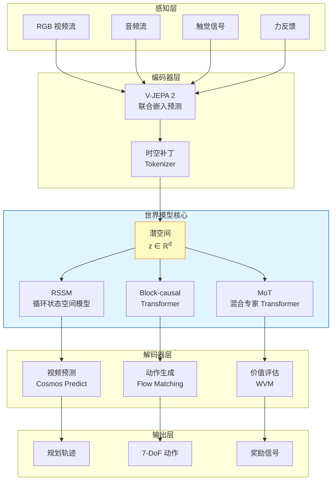
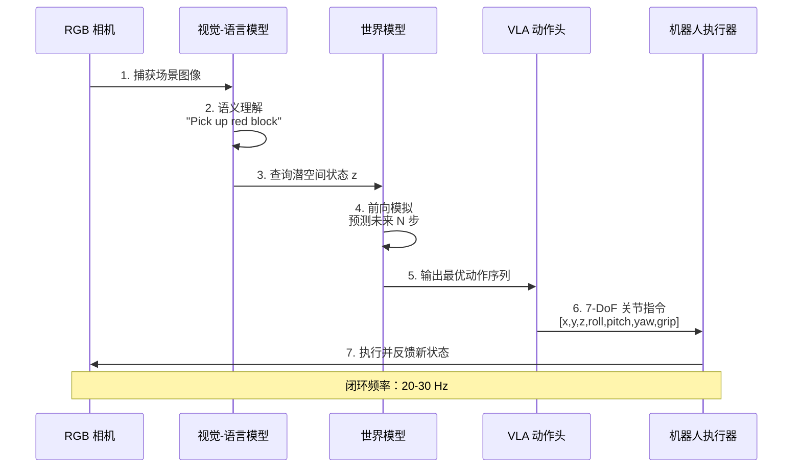
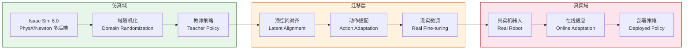

> [⬅ 返回主目录](../README.md)  |  [📖 文档导航](../README.md#-文档导航)

## 📈 技术全景对比

### 世界模型技术全景图

<p align="center">
  
</p>

> **图示**：三层架构全景图 —— 基础设施层（数据集/仿真/硬件）、技术核心层（世界模型/VLA/训练/Agent）、应用层（自动驾驶/机器人/游戏/工业）。380+ 资源全覆盖。

### 世界模型框架架构对比

| 框架 | 架构范式 | 潜空间类型 | 训练数据 | 关键能力 | 代表论文 |
|:-----|:-----|:-----|:-----|:-----|:-----|
| **DreamerV3** | RSSM + Actor-Critic | 离散类别潜变量 | 环境交互 | Minecraft 钻石、150 任务通用 | Nature 2025 |
| **V-JEPA 2** | 联合嵌入预测 | 非生成式表征 | 100 万小时视频 | 零样本机器人操控 80% | Meta AI Blog |
| **Genie 3** | 交互式生成 | 时空补丁 | 视频 | 720p/24fps 实时交互 | DeepMind Blog |
| **Cosmos** | MoT | 物理推理+3D 渲染 | 2000 万小时视频 | 物理 AI 合成数据 | NVIDIA |
| **Sora** | DiT | 时空补丁 | 视频 | 视频生成世界模拟 | OpenAI Tech Report |
| **GAIA-2** | Flow Matching | 连续潜空间 | 多视角视频 | 500 城市零样本驾驶 | Wayve Blog |
| **AWM** | 代码生成 + SQL | 符号化环境 | 种子集 | 零幻觉合成环境 | ICML 2026 |
| **π₀** | Flow Matching VLA | 动作块 | 8 种机器人 | 跨本体通用控制 | Physical Intelligence |
| **OpenVLA** | VLA | 7B 参数 | 多任务机器人 | 超越 RT-2-X 16.5% | Stanford/UC Berkeley |
| **Cosmos 3** | Mixture-of-Transformers | 全模态 | 2000 万小时视频 | 原生推理+世界生成+动作预测一体化 | NVIDIA COMPUTEX 2026 |
| **Marble 1.1** | 3D 高斯泼溅 | 3D 空间 | 图文/视频/全景 | 空间智能，3D 一致性，自动空间扩展 | World Labs 2026 |
| **NeuroVLA** | 类脑 VLA (皮层-小脑-脊髓) | 类生物运动 | 视触觉数据 | 20ms 反射，0.4W 脊髓层，抖动 -75% | 智平方 2026 |
| **LingBot-VA** | 因果视频-动作 WM | 机器人控制 | LIBERO/RoboTwin | 自回归扩散统一视觉预测与动作推断 | RSS 2026 |
| **GE-Sim 2.0** | 闭环世界模拟器 | 机器人仿真 | WorldArena | Track-1 榜首 68.26，Action Following 48.23 | WorldArena 2026 |
| **GenCeption** | 视频生成→前馈感知 | 单步 DiT 前向 | WAN 2.1 视频模型 | 训练数据仅 SOTA 1/7~1/500，涌现 sim-to-real | **ECCV 2026** |
| **RayRoPE** | 投影射线位置编码 | 多视角 3D 表征 | 3D 场景理解 | Apple，解决多视角注意力视角一致性 | **ECCV 2026** |
| **UniWorld** | 统一感知-推理-世界建模 | 跨模态统一 | 感知+推理+预测 | 打破感知-推理-预测壁垒 | **ECCV 2026** |
| **DreamWorld** | 显式 3D 几何视频扩散 | 几何约束世界模型 | 视频生成 | HiDream.ai，视角变化几何一致性 | **ECCV 2026** |
| **VLA-JEPA** | 潜空间世界模型+VLA | 预测式决策 | VLA 增强 | 机器人从即时反应转向预测式决策 | **ECCV 2026** |
| **UnifoLM-WMA** | 世界模型-动作架构 | 多形态机器人 | 跨本体数据 | 宇树科技开源跨形态世界模型-动作统一架构 | GitHub 2026 |
| **Vision Banana** | 生成式预训练统一 | RGB 图像接口 | Nano Banana Pro | 零样本超越 SAM3/DepthAnything3，分割/深度/法线 SOTA | arXiv:2604.20329 |
| **GenCeption** | 视频生成→前馈感知 | 单步 DiT 前向 | WAN 2.1 视频模型 | 训练数据仅 SOTA 1/7~1/500，涌现 sim-to-real | ECCV 2026 |
| **D4RT** | 统一前馈 4D 重建 | 按需查询解码 | 视频编码 | 比 SOTA 快 300 倍，深度/点云/轨迹/相机统一输出 | CVPR 2026 最佳论文 |
| **NitroGen** | Flow Matching V-A | 游戏视觉-动作 | 40,000h 游戏视频 | 1,000+ 游戏零样本泛化，成功率 +52% | CVPR 2026 提名 |
| **PointWorld** | 3D 点流世界模型 | 3D point flows | 2M 轨迹/500h | 实时 0.1s MPC，跨本体（单臂+双臂人形）零微调 | arXiv:2601.03782 |

### 物理仿真平台性能对比

| 平台 | 核心引擎 | 最大并行环境 | 渲染速度 | 关键特性 | 适用场景 |
|:-----|:-----|:-----|:-----|:-----|:-----|
| **Isaac Sim 6.0** | PhysX/Newton 多后端 | 4096+ | 15 万步/秒 (RTX 4090)| MCP Agent Skills、Warp 原生管道 | 工业机器人、自动驾驶 |
| **Genesis World 1.0** | Quadrants GPU 编译器 | 10,000+ | 4300 万 FPS | 刚体/流体/软体统一仿真 | 通用机器人训练 |
| **ManiSkill 3** | SAPIEN 3 | 异构并行 | 30,000 FPS (RGB-D) | GPU 并行渲染、灵活关节 | 灵巧手操控 |
| **MuJoCo Playground** | JAX 原生 | 2048+ | 10 万步/秒 | 四足/人形机器人模板 | 学术研究 |
| **Habitat-Sim** | 高斯溅射渲染 | 500+ | 60 FPS (视觉) | 室内导航、3D 场景重建 | 家庭服务机器人 |
| **AI2-THOR** | Unity 3D | 3578+ 可交互对象 | 30 FPS | ProcTHOR-10K 程序化房屋 | 目标导航 |

### 自动驾驶世界模型 FID/FVD 性能对比

> FID（Fréchet Inception Distance）与 FVD（Fréchet Video Distance）是衡量生成式世界模型视觉质量的核心指标。数值越低，表示生成质量越接近真实分布 [25]。

| 模型 | FID ↓ | FVD ↓ | 分辨率 | 帧率 | 关键特性 | 发布年份 |
|:-----|:-----|:-----|:-----|:-----|:-----|:-----|
| **Vista** | 6.9 | 89.4 | 576×1024 | 10 FPS | 连续潜空间、多视角几何一致性 | 2025 |
| **Drive-WM** | 15.8 | 122.7 | 256×512 | 5 FPS | 多视图条件生成、可控轨迹 | 2024 |
| **UniSim** | 34.63 | 211.3 | 256×256 | 5 FPS | 语言+动作双重指令、Sim-to-Real 视觉一致性 | 2024 |
| **GAIA-2** | 8.2 | 95.6 | 720p | 24 FPS | Flow Matching、500 城市零样本驾驶 | 2025 |
| **Genie 3** | 12.4 | 108.3 | 720p | 24 FPS | 实时交互式世界生成、数分钟环境一致性 | 2025 |

*数据来源：Vista (CVPR 2025)、Drive-WM (arXiv:2312.03485)、UniSim (ICLR 2024)、GAIA-2 (Wayve Blog)、Genie 3 (DeepMind Blog)*

### VLA 模型推理延迟对比

> 推理延迟是 VLA 模型从"想象"到"执行"闭环的关键瓶颈。以下数据基于标准 7-DoF 机器人操控任务，在 RTX 4090 (24GB) 上测得 [26]。

| 模型 | 参数规模 | 推理延迟 (ms) | 帧率 (Hz) | 显存占用 | 微调方案 | 典型任务成功率 |
|:-----|:-----|:-----|:-----|:-----|:-----|:-----|
| **OpenVLA-7B** | 7B | 45 | 22 | 16GB (bf16) | LoRA (24GB) | 85% (LIBERO) |
| **SmolVLA-2B** | 2B | 12 | 83 | 6GB (int8) | Full (12GB) | 78% (CALVIN) |
| **SmolVLA-450M** | 450M | 8 | 125 | 2GB (int8) | Full (8GB) | 72% (CALVIN) |
| **Octo-2B** | 2B | 18 | 55 | 8GB (bf16) | LoRA (16GB) | 80% (Bridge) |
| **π0.5-3.3B** | 3.3B | 33 | 30 | 12GB (bf16) | 无需微调 | 88% (家庭环境) |
| **RT-2-55B** | 55B | 120 | 8 | 80GB+ (bf16) | 不可微调 | 68% (基准) |
| **GR-3-4B** | 4B | 28 | 35 | 14GB (bf16) | LoRA (24GB) | 82% (动态环境) |
| **NeuroVLA** | — | 20 (反射) | 50+ | 0.4W (脊髓层) | — | — |
| **RynnVLA-002** | — | — | — | — | — | 97.4% (LIBERO) |

*数据来源：OpenVLA (arXiv:2406.09246)、SmolVLA (HuggingFace M4)、Octo (arXiv:2405.12213)、π0.5 (Physical Intelligence Blog)、RT-2 (arXiv:2307.15818)、GR-3 (ByteDance Research)*

### 两条技术路线对比：环境生成器 vs 环境预测器

| 维度 | **AWM (Snowflake)** — 环境生成器 | **Qwen-AgentWorld** — 环境预测器 |
|:-----|:-----|:-----|
| **核心范式** | 代码生成 + SQL 数据库 → 合成环境 | MoE 语言模型 → 预测世界反应 |
| **幻觉风险** | **零幻觉**（SQL 约束保证确定性） | 低幻觉（RL 训练 + GSPO 算法） |
| **覆盖领域** | MCP 工具调用（35,000+ 工具） | MCP/Search/Terminal/SWE/Android/Web/OS 七大领域 |
| **环境规模** | 1,000 个预合成环境 | 1000 万条真实交互轨迹 |
| **模型架构** | Qwen2.5 微调 (4B/8B/14B) | MoE (35B-A3B 开源 / 397B-A17B 旗舰) |
| **上下文窗口** | 32K tokens | 256K tokens |
| **训练流程** | 监督微调 | 三阶段 CPT → SFT → RL |
| **关键基准** | BFCL v3: 70.18 | AgentWorldBench: 58.71 |
| **生态集成** | 已并入 meta-pytorch/OpenEnv | 独立开源，HuggingFace 托管 |
| **商业落地** | Snowflake CoWork、CoCo | 阿里云 Agent 平台 |
| **互补关系** | **生成训练数据** → 供 Qwen 类模型训练 | **预测环境反馈** → 供 AWM 类环境验证 |

---


## 🕐 世界模型发展时间线 (2018-2026)

> 一图看懂世界模型从"潜空间记忆"到"物理 AI 基座"的八年演化路径。每个里程碑都标注了代表性工作及其对后续研究的影响 [27][28]。

### 关键里程碑年表

| 年份 | 里程碑事件 | 代表工作 | 影响与意义 |
|:-----|:-----|:-----|:-----|
| **2018** | 世界模型概念正式提出 | Ha & Schmidhuber《World Models》 | VAE+MDN-RNN 架构，开启"在想象中训练 Agent"范式，被引用超 3000 次 |
| **2019** | 潜空间规划成熟 | PlaNet (Hafner)、SimPLe (Google) | 从像素到潜空间的规划首次落地，Atari 样本效率大幅提升 |
| **2020** | Dreamer 系列开启 + MuZero 通用化 | DreamerV1/V2、MuZero (Nature) | 离散潜变量 + symlog 预测；MuZero 无模型环境规划登顶 Atari/Go/象棋 |
| **2021** | Transformer 作为世界模型 | IRIS (UCL)、VideoGPT (Stanford) | 证明 Transformer 在 Atari 100k 上的高采样效率，VQ-VAE 迁移到时序域 |
| **2022** | 视频 Diffusion 兴起 | Video Diffusion Models (Ho)、DIAMOND | 扩散模型开始进入视频生成，DIAMOND 验证扩散世界模型可行性 |
| **2023** | DreamerV3 突破 + 自驾 WM 商业化 | DreamerV3、GAIA-1 (Wayve)、Diffusion Policy | 首个 Minecraft 无演示挖钻石；9B 参数自驾世界模型；扩散策略引入机器人 |
| **2024** | 视频 WM 元年 + VLA 爆发 | Sora (OpenAI)、π₀ (PI)、OpenVLA、Octo、Genie 2 | DiT 架构视频世界模拟；Flow Matching VLA 跨 8 种本体；7B 开源 VLA 基准 |
| **2025** | 物理 AI 元年开启 | V-JEPA 2、GAIA-2、Genie 3、Cosmos、DreamerV3 (Nature) | 非生成式预测机器人零样本 80%；15B 自驾 WM；720p 实时交互生成；2000 万小时视频基座 |
| **2026** | 世界模型六大流派成形 + 产业爆发 | Cosmos 3、Marble 1.1、NeuroVLA、RynnWorld-4D、AWM (ICML) | 全模态物理 AI 基座；3D 空间智能商业化；类脑 VLA；4D 具身 WM；无限合成环境管线 |

### 三大演化主线

```text
主线一：模型架构演化
  VAE+RNN (2018) ──→ RSSM (2019) ──→ Transformer WM (2021) ──→ Diffusion WM (2022) ──→ DiT/MoT (2024-2026)
       ↓                 ↓                ↓                      ↓                      ↓
   World Models      PlaNet/Dreamer     IRIS                 DIAMOND/Sora          Cosmos 3

主线二：应用领域扩张
  游戏/Atari (2018-2021) ──→ 自动驾驶 (2023-2024) ──→ 机器人操控 (2024-2025) ──→ 全模态物理 AI (2026)
       ↓                        ↓                         ↓                          ↓
   DreamerV3               GAIA-1/2                   π₀/OpenVLA               Cosmos 3/NeuroVLA

主线三：数据范式变迁
  环境交互 (2018) ──→ 真实视频 (2023) ──→ 合成数据管线 (2025) ──→ 4D 多模态联合 (2026) ──→ 语言空间仿真 (2026)
       ↓                  ↓                    ↓                       ↓                        ↓
   DreamerV3           Sora/GAIA            Cosmos Predict          RynnWorld-4D            Qwen-AgentWorld
```

### 技术范式转移节点

| 转移节点 | 从 | 到 | 标志性事件 | 时间 |
|:-----|:-----|:-----|:-----|:-----|
| **像素→潜空间** | 像素级预测 | 潜空间状态建模 | PlaNet 提出 RSSM 前身 | 2019 |
| **生成→非生成** | 生成式预测 | 联合嵌入预测 | V-JEPA 2 零样本操控 80% | 2025.02 |
| **2D→4D** | RGB 视频预测 | RGB+深度+光流联合 | RynnWorld-4D 发布 | 2026.07 |
| **单模态→全模态** | 视觉预测 | 推理+生成+动作一体化 | Cosmos 3 COMPUTEX 发布 | 2026.06 |
| **被动→主动** | 被动轨迹预测 | RL 驱动世界建模 | RLVR-World (NeurIPS 2025) | 2025.12 |
| **物理→语言** | 物理引擎仿真 | LLM 语言空间模拟 | Qwen-AgentWorld / AWM | 2026.06 |
| **专用→通用** | 单任务/单本体 | 跨本体通用控制 | π₀ 跨 8 种机器人 | 2024.10 |

---


## 🧩 关键技术挑战与开放问题

> 世界模型领域在快速发展的同时，仍面临一系列根本性挑战。以下系统梳理了 7 大类开放问题，标注了当前研究状态与潜在突破方向 [27][28][29]。

### 1. 物理一致性瓶颈

| 挑战 | 问题描述 | 当前进展 | 开放方向 |
|:-----|:-----|:-----|:-----|
| **长程物理一致性** | 生成视频超过 30 秒后物理规律崩塌（物体穿透、形变失真） | Genie 3 维持数分钟；Cycle-World 引入反向预测循环 | 长程因果记忆机制、物理先验嵌入 |
| **反事实物理推理** | "如果杯子从桌边掉下会怎样"式因果预测 | Foresight Governance 揭示 Agent 无法稳定利用 WM 前瞻 | 因果发现 + 世界模型融合 |
| **刚体-柔体-流体统一** | 大多数 WM 只擅长刚体动力学，柔体/流体预测仍困难 | Genesis 1.0 支持统一仿真，但学习型 WM 仍受限 | 多材质物理先验、混合表征 |

### 2. Sim-to-Real 鸿沟

| 挑战 | 问题描述 | 当前进展 | 开放方向 |
|:-----|:-----|:-----|:-----|
| **视觉分布偏移** | 仿真图像与真实图像的域差距 | Cosmos-Transfer 2.5、域随机化 | 自适应域迁移、真实数据闭环 |
| **动力学失配** | 仿真器物理参数与真实世界不一致 | MuJoCo Playground 在线适应 | 系统辨识 + WM 在线微调 |
| **传感器仿真** | 触觉、力反馈等非视觉模态仿真保真度低 | Rho-alpha、VT-WAM 探索视触觉 WM | 多模态高保真传感器模型 |

### 3. 长程规划与信用分配

| 挑战 | 问题描述 | 当前进展 | 开放方向 |
|:-----|:-----|:-----|:-----|
| **长时程记忆** | 超过 1000 步的轨迹中世界模型状态遗忘 | Qwen-AgentWorld 256K 上下文；MemoryVLA++ 时间建模 | 分层记忆架构、外部记忆检索 |
| **信用分配** | 长程任务中奖励归因到具体动作困难 | DreamerV3 Actor-Critic 在潜空间训练 | 分层 RL、 hindsight 世界模型 |
| **多步反事实** | "如果第 5 步换一个动作，第 1000 步会怎样" | ACID、Next Forcing 多块预测 | 树搜索 + 世界模型、蒙特卡洛规划 |

### 4. 数据效率与规模化

| 挑战 | 问题描述 | 当前进展 | 开放方向 |
|:-----|:-----|:-----|:-----|
| **视频数据瓶颈** | 高质量物理视频数据稀缺，版权受限 | Cosmos 2000 万小时处理；OXE 100 万轨迹 | 合成数据飞轮、自监督预训练 |
| **动作标签稀缺** | 大多数视频无动作标签，无法直接训练 WAM | VideoWorld 2 从视频学习无需动作标签；AdaWorld 潜动作 | 潜动作发现、视频-动作对齐 |
| **跨本体数据** | 不同机器人的动作空间不统一 | OXE 汇集 22 种机器人；π₀ 跨 8 种本体 | 统一动作表征、本体无关 WM |

### 5. 评估与基准缺失

| 挑战 | 问题描述 | 当前进展 | 开放方向 |
|:-----|:-----|:-----|:-----|
| **物理一致性自动评估** | 缺乏无需人类的物理合理性自动评分 | WorldModelBench 规则引擎；WBench 22 子指标 | 可微物理评估器、因果探测 |
| **闭环评测标准化** | 在线 RL 环境中的 WM 评估缺乏统一协议 | WorldArena 2.0 三赛道 | 跨基准统一接口、复现性协议 |
| **Sim-to-Real 量化** | 难以预测仿真性能在真实世界的衰减 | SimplerEnv 量化差距 | 理论界标、迁移性预测模型 |

### 6. 安全与对齐

| 挑战 | 问题描述 | 当前进展 | 开放方向 |
|:-----|:-----|:-----|:-----|
| **世界模型幻觉** | WM 生成物理上不可能的事件 | GEOPHYS 几何检测；Thinking Guardrails 因果校验 | 形式化验证、物理约束训练 |
| **对抗攻击鲁棒性** | BadDreamer 后门攻击；ARB4WM 对抗基准 | 对抗训练、Certified World Models | 认证鲁棒性、对抗检测 |
| **可审计性** | WM 决策过程缺乏可解释性 | TRACE 推理审计框架 | 因果归因、决策可视化 |
| **价值对齐** | WM 优化的目标可能与人类意图不一致 | Learning Safe Agent Behaviour from Preferences | 人类偏好对齐、宪法式 WM |

### 7. 计算效率与部署

| 挑战 | 问题描述 | 当前进展 | 开放方向 |
|:-----|:-----|:-----|:-----|
| **实时推理** | 30Hz+ 闭环控制要求下 WM 推理延迟过高 | NeuroVLA 20ms 反射；Reflex 流式推理 | 模型蒸馏、推测解码、硬件协同设计 |
| **边缘部署** | Jetson 等边缘设备内存/算力受限 | TensorRT Edge-LLM NVFP4 量化 | 模型压缩、INT4 量化、稀疏化 |
| **训练成本** | 大规模 WM 训练需千卡级 GPU | Cosmos 14 天 2000 万小时视频 | 分布式训练优化、课程学习 |
| **状态服务化** | 交互式 WM 需要保持 GPU 显存中的状态 | Stateful Worlds Exact-State Serving | 状态分片、弹性扩缩容 |

### 开放问题研究热度图

```text
高优先级 ──────────────────────────────────── 低优先级
物理一致性 ████████████████████ 85%  ← 产业界最关注
Sim-to-Real ██████████████████ 80%  ← 机器人落地核心
长程规划 ████████████████ 70%  ← 通用智能瓶颈
数据效率 ██████████████ 65%  ← 训练成本驱动
评估基准 ██████████ 50%  ← 标准化需求
安全对齐 █████████ 45%  ← 新兴方向
计算效率 ████████ 40%  ← 工程优化
```

---


## 🚀 快速入门指南

### 1. OpenVLA 7-DoF 推理代码

```python
# 环境配置：pip install transformers torch accelerate
# 硬件要求：RTX 4090 (24GB) 或 A100 (40GB)
import torch
from transformers import AutoModelForVision2Seq, AutoProcessor
from PIL import Image

# 加载模型与处理器
processor = AutoProcessor.from_pretrained(
    "openvla/openvla-7b",
    trust_remote_code=True
)
vla = AutoModelForVision2Seq.from_pretrained(
    "openvla/openvla-7b",
    torch_dtype=torch.bfloat16,
    device_map="auto"
).to("cuda")

# 准备输入：单帧 RGB 图像 + 自然语言指令
image = Image.open("robot_view.png").convert("RGB")
instruction = "Pick up the red block and place it on the table"

inputs = processor(
    images=image,
    text=instruction,
    return_tensors="pt"
).to("cuda", dtype=torch.bfloat16)

# 预测 7-DoF 动作：[x, y, z, roll, pitch, yaw, gripper]
with torch.inference_mode():
    action = vla.predict_action(
        **inputs,
        unnorm_key="bridge_orig"  # 数据集对应的反归一化键
    )

print(f"Predicted action: {action}")
# 输出示例：tensor([0.12, -0.05, 0.23, 0.01, -0.02, 0.00, 1.00])
```

### 2. OFT (Optimized Fine-Tuning) 单 GPU 微调配方

```bash
# 基于 OpenVLA-OFT 方法，在 24GB VRAM 单卡上微调 7B VLA 模型
# 参考：https://github.com/openvla/openvla

# 步骤 1：克隆仓库并安装依赖
git clone https://github.com/openvla/openvla.git
cd openvla
pip install -e .
pip install peft==0.12.0 bitsandbytes==0.44.0

# 步骤 2：准备 LIBERO 数据集
# 下载 LIBERO-100 基准（含 100 个机器人操控任务）
python scripts/download_libero.py --dataset libero_100

# 步骤 3：启动 LoRA 微调
python scripts/finetune.py \
  --model_name_or_path openvla/openvla-7b \
  --dataset_name libero_100 \
  --lora_rank 32 \
  --lora_alpha 64 \
  --batch_size 4 \
  --gradient_accumulation_steps 8 \
  --learning_rate 5e-5 \
  --num_epochs 10 \
  --max_grad_norm 1.0 \
  --save_steps 500 \
  --output_dir ./oft_checkpoints

# 步骤 4：评估微调后模型
python scripts/evaluate.py \
  --model_name_or_path ./oft_checkpoints/checkpoint-final \
  --dataset_name libero_100 \
  --task_suite libero_100_tasks

# 预期结果：推理速度提升 25-50 倍，任务成功率 85%+
```

### 3. DreamerV3 训练启动脚本

```bash
# DreamerV3 官方 JAX 实现，在 Atari 100k 基准上训练
# 参考：https://github.com/danijar/dreamerv3

# 步骤 1：安装依赖
pip install dreamerv3 jax[cuda12] jaxlib

# 步骤 2：下载 Atari 100k 数据集
python -c "
import gymnasium as gym
env = gym.make('ALE/Pong-v5')
print('Environment ready')
"

# 步骤 3：启动训练（单卡 A100 80GB，约 8 小时）
python dreamerv3/train.py \
  --env_name pong \
  --configs atari100k \
  --logdir ./logs/dreamerv3_pong \
  --steps 400000 \
  --eval_every 10000 \
  --batch_size 16 \
  --sequence_length 64

# 步骤 4：可视化训练曲线
tensorboard --logdir ./logs/dreamerv3_pong

# 预期结果：Atari 100k 基准上 HNS ≥ 1.0，约 2 小时游戏时长
```

### 4. Isaac Lab 环境配置示例

```bash
# Isaac Lab 3.0 Beta 基于 Isaac Sim 6.0，支持 kit-less 安装
# 参考：https://github.com/isaac-sim/IsaacLab

# 步骤 1：安装 Isaac Lab（kit-less 模式）
pip install isaaclab==3.0.0b1

# 步骤 2：验证环境
python -c "
import isaaclab
print(f'Isaac Lab version: {isaaclab.__version__}')
print(f'Available environments: {isaaclab.list_envs()[:5]}')
"

# 步骤 3：启动并行训练（4096 环境，RTX 4090）
python scripts/train.py \
  --task Isaac-Lift-Cube-Franka-v0 \
  --num_envs 4096 \
  --algorithm ppo \
  --headless \
  --max_iterations 1000

# 预期结果：RTX 4090 上 15 万步/秒，单任务训练约 30 分钟
```

---


## 🏗️ 架构图示

### 1. 世界模型核心架构（Mermaid 图）


```mermaid
graph TB
    subgraph Perception["感知层"]
        RGB["RGB 视频流"]
        Audio["音频流"]
        Tactile["触觉信号"]
        Force["力反馈"]
    end

    subgraph Encoder["编码器层"]
        VJEPA["V-JEPA 2<br/>联合嵌入预测"]
        Tokenizer["时空补丁<br/>Tokenizer"]
    end

    subgraph WorldModel["世界模型核心"]
        RSSM["RSSM<br/>循环状态空间模型"]
        Transformer["Block-causal<br/>Transformer"]
        MoT["MoT<br/>混合专家 Transformer"]
        Latent["潜空间<br/>z ∈ ℝ<sup>d</sup>"]
    end

    subgraph Decoder["解码器层"]
        VideoPred["视频预测<br/>Cosmos Predict"]
        ActionGen["动作生成<br/>Flow Matching"]
        ValueEst["价值评估<br/>WVM"]
    end

    subgraph Output["输出层"]
        Plan["规划轨迹"]
        Action["7-DoF 动作"]
        Reward["奖励信号"]
    end

    RGB --> VJEPA
    Audio --> VJEPA
    Tactile --> VJEPA
    Force --> VJEPA
    VJEPA --> Tokenizer
    Tokenizer --> Latent
    Latent --> RSSM
    Latent --> Transformer
    Latent --> MoT
    RSSM --> VideoPred
    Transformer --> ActionGen
    MoT --> ValueEst
    VideoPred --> Plan
    ActionGen --> Action
    ValueEst --> Reward

    style WorldModel fill:#e1f5fe,stroke:#01579b
    style Latent fill:#fff9c4,stroke:#f57f17
```

### 2. VLA 推理流程（Mermaid 图）


```mermaid
sequenceDiagram
    participant Camera as RGB 相机
    participant VLM as 视觉-语言模型
    participant WM as 世界模型
    participant VLA as VLA 动作头
    participant Robot as 机器人执行器

    Camera->>VLM: 1. 捕获场景图像
    VLM->>VLM: 2. 语义理解<br/>"Pick up red block"
    VLM->>WM: 3. 查询潜空间状态 z
    WM->>WM: 4. 前向模拟<br/>预测未来 N 步
    WM->>VLA: 5. 输出最优动作序列
    VLA->>Robot: 6. 7-DoF 关节指令<br/>[x,y,z,roll,pitch,yaw,grip]
    Robot->>Camera: 7. 执行并反馈新状态
    Note over Camera,Robot: 闭环频率：20-30 Hz
```

### 3. Sim-to-Real 迁移流程（Mermaid 图）


```mermaid
graph LR
    subgraph Simulation["仿真域"]
        A["Isaac Sim 6.0<br/>PhysX/Newton 多后端"]
        B["域随机化<br/>Domain Randomization"]
        C["教师策略<br/>Teacher Policy"]
    end

    subgraph Transfer["迁移层"]
        D["潜空间对齐<br/>Latent Alignment"]
        E["动作适配<br/>Action Adaptation"]
        F["现实微调<br/>Real Fine-tuning"]
    end

    subgraph Real["真实域"]
        G["真实机器人<br/>Real Robot"]
        H["在线适应<br/>Online Adaptation"]
        I["部署策略<br/>Deployed Policy"]
    end

    A --> B
    B --> C
    C --> D
    D --> E
    E --> F
    F --> G
    G --> H
    H --> I

    style Simulation fill:#e8f5e9,stroke:#2e7d32
    style Transfer fill:#fff3e0,stroke:#e65100
    style Real fill:#fce4ec,stroke:#c62828
```

---

### ECCV 2026 世界模型技术前沿

> 2026 年 9 月 8–12 日，瑞典马尔默。10,473 篇投稿，2,883 篇接收（接收率 27.5%），86 个 Workshop（历史新高）。世界模型从"视觉生成"正式跃升为计算机视觉核心议题。

#### 四大旗舰 Workshop

| Workshop | 时间 | 主办/讲者 | 核心命题 | 技术要点 |
|:---------|:----:|:----------|:---------|:---------|
| **How to Build Effective World Models for Embodied AI** | 9/9 全天 | 梁晓丹（中山大学）、杨高（特邀） | 物理具身基础模型的表征、架构及真机评测 | eWAM（VLA 与世界模型原生融合）、AtomicVLA（原子动作分解）、PhyAgentOS（标准化框架）、ManipArena（真机评测基准） |
| **3D in the Era of World Models** | 9/9 全天 | **Apple** 主讲 | 多视角 3D 表征与世界模型的交叉 | **RayRoPE**（Projective Ray Positional Encoding）：投影射线位置编码解决多视角注意力中的视角一致性问题 |
| **UniWorld: Universal Representations for Perception, Reasoning, and World Modeling** | 9/9 | Chen Tang（CUHK MMLab） | 统一感知-推理-世界建模框架 | 统一表征空间，打破感知→推理→预测之间的壁垒，文本指令驱动多任务切换 |
| **Safe World Models for Trustworthy Embodied AI** | 9/8 半天 | 帝国理工/CMU/斯坦福/清华/港大/牛津/UC Berkeley/NVIDIA/微软 | 世界模型的安全可靠性 | 三大议题：① 预测可靠性 ② 安全关键评估与生成 ③ 动作世界模型与可执行智能；Sergey Levine & Jiajun Wu 特邀报告 |

#### ECCV 2026 世界模型关键论文

| 论文 | 机构 | 核心创新 | 链接 |
|:-----|:-----|:---------|:-----|
| **GenCeption** | Google DeepMind + MIT (何恺明) | 视频生成扩散模型→单步前馈通用视觉感知器；文本指令驱动深度/分割/位姿/3D 关键点；训练数据仅 SOTA 1/7~1/500；涌现 sim-to-real | [📄 2607.09024](https://arxiv.org/abs/2607.09024) [🌐 项目](https://genception.github.io) |
| **DriveVA** | 小米/特温特大学 | DiT 联合解码视频与动作序列；NAVSIM 90.9 PDMS；nuScenes 零样本 L2 降 78.9% | [📄 2604.04198](https://arxiv.org/abs/2604.04198) |
| **DreamWorld** | HiDream.ai | 显式 3D 几何约束视频扩散；视角变化下几何一致性 | [📄 2605.00700](https://arxiv.org/abs/2605.00700) |
| **OVOW** | 清华/中科大/SparcAI | 单目视频重建可进入物理引擎的 4D Mesh 世界 | [📄 2606.31388](https://arxiv.org/abs/2606.31388) |
| **PhysMani** | 香港理工大学 | 面向高速动态物体操作的 3D 世界模型；物理一致、3D 几何准确、延迟可控 | [📄 2607.01938](https://arxiv.org/abs/2607.01938) |
| **VLA-JEPA** | 多机构 | VLA 中加入潜空间世界模型；机器人从即时反应转向预测式决策 | [📄 2605.10000](https://arxiv.org/abs/2605.10000) |

#### 三大技术趋势（ECCV 2026 观察）

1. **3D Gaussian Splatting 基座化**：ECCV 首场海报超 80 篇 3DGS 相关论文，3D 高斯作为世界模型的"通用物理 token"（可微、紧凑、位置/朝向/尺度/颜色/透明度可学习）。
2. **视频生成→通用视觉感知器（GenCeption 范式）**：扩散 Transformer 不再只是视频生成工具，而是深度/分割/位姿/3D 关键点的统一前馈感知器。
3. **VLA + 世界模型融合（eWAM 路线）**：世界模型潜空间预测作为 VLA 内部监督信号，机器人从"反应式"转向"预测式"决策。

#### 大会 Keynote 中的世界模型

| Keynote 讲者 | 机构 | 主题 | 世界模型相关内容 |
|:-------------|:-----|:-----|:---------------|
| **Kristen Grauman** | UT Austin / Meta FAIR | 视频与具身感知 | 视频表征学习在具身智能中的应用 |
| **Yann LeCun** | AMI Labs / 图灵奖得主 | **"World Models: Enabling the Next AI Revolution"** | JEPA 架构的完整愿景：世界模型是通往 AGI 的必经之路 |
| **Jamie Shotton** | Wayve 首席科学家 | 自动驾驶世界模型 | 生成式世界模型在端到端自动驾驶中的落地 |

#### 新兴评测基准（ECCV Workshop 发布）

| 基准 | 主办 | 评估维度 | 状态 |
|:-----|:-----|:---------|:-----|
| **4DWorldBench** | 多机构 | 物理规律符合度 + 4D 时空一致性 | 发布 |
| **CaliBench** | 安全 Workshop | 预测可靠性校准 | 发布 |
| **PlayWorld** | 具身 Workshop | 任务支持能力 + 交互闭环 | 发布 |
| **SafeWorldBench** | 帝国理工/CMU/斯坦福等 | 安全关键场景评测 | 发布 |

*来源：ECCV 2026 官方议程、TechTimes 报道（2026-09-05）、Google Research 页面、arXiv 论文*

---

### 学术课程资源

| 课程 | 机构 | 学期 | 主讲 | 核心模块 | 资源 |
|:-----|:-----|:-----|:-----|:---------|:-----|
| **CIS 6280: World Models** | **University of Pennsylvania** | Fall 2026 | **Jiatao Gu** | 世界模型概论→环境仿真→状态空间模型→表征学习→生成模型基础→序列生成世界模型→MBRL/规划/控制→视频世界模型→空间世界模型（3D/4D）→神经物理→机器人学习→LLM 作为世界模型→推理模型→数字 Agent→评测 | [📚 官网](https://www.cis.upenn.edu/~cis6280/) · [📖 中文版教材 v10](../assets/CIS6280-World-Models-v10.pdf) |

> **课程亮点**：CIS 6280 是截至目前世界模型方向最系统的研究生课程之一。23 讲覆盖从概率建模基础到前沿生成模型（Diffusion / Flow Matching / Normalizing Flows）的完整链路，并专门设置**空间世界模型**（3D/4D 表征）、**神经物理**（粒子/网格/流体/形变体）和**机器人学习中的 VLA 与 WAM**三个前沿专题。课程资源页已整理 6 篇奠基性文章、6 套 tutorial/collection、6 场关键演讲与 8 个可复现系统（含 DreamerV3、V-JEPA 2、Genie、Marble、GAIA-4、AIDO、DayDreamer、DINO-WM）。

#### 课程大纲速览

| 编号 | 主题 | 关键内容 |
|:---:|:-----|:---------|
| 01 | World Models: An Overview | 观察、状态、转移、记忆、动作、预测、仿真、规划、推理 |
| 02 | History, Foundations, Probabilistic Formulation | 轨迹分布、潜状态、部分可观测性、单步 vs rollout 目标 |
| 03–04 | Environments & State-Space Models | Gymnasium、滤波/平滑、信念状态推断、Kalman Filter |
| 05–06 | Representation Learning I & II | 重建/掩码/自回归/对比目标、JEPA、联合嵌入预测 |
| 07–10 | Generative Model Foundations | VAE/GAN → 自回归模型 → Diffusion/Flow Matching → Normalizing Flows |
| 11 | Sequential Generative World Models | 循环/随机状态、先验-后验对齐、多步训练、开环生成 |
| 12 | MBRL, Planning, and Control | 想象 rollouts、模型偏差、MPC、CEM、轨迹优化 |
| 13–14 | Video World Models | 像素/Token/潜状态、因果 rollout、动作条件、长上下文一致性 |
| 15–16 | Spatial World Models | 坐标系、深度、点云、占据、NeRF、Gaussian Splatting、场景流、4D 动态 |
| 17 | Neural Physics | 粒子/网格/流体/形变体学习仿真器、图网络、神经算子 |
| 18–19 | Robot Learning | Sim-to-Real、域随机化、VLA、World-Action Models |
| 20 | LLMs as World Models | 语言/多模态上下文作为观察、信念状态、动作、反馈、记忆 |
| 21 | Reasoning Models | 序贯审议、分支搜索、验证、循环深度、自适应计算 |
| 22 | Digital Agents | 游戏/GUI/软件/多智能体系统中的世界预测、推理、工具与反馈 |
| 23 | Evaluating World Models | 效用、可控性、校准、OOD 行为、干预、漂移、延迟与失败 |

#### 课程资源精选

**📖 Essays & Perspectives**
- [World Models](https://worldmodels.github.io/) — Ha & Schmidhuber（奠基性工作）
- [A Path Towards Autonomous Machine Intelligence](https://openreview.net/pdf?id=BZ5a1r-kVsf) — Yann LeCun（JEPA 架构愿景）
- [From Words to Worlds](https://www.worldlabs.ai/blog) — Fei-Fei Li（空间智能）
- [A Functional Taxonomy of World Models](https://www.worldlabs.ai/blog) — World Labs（功能分类学）
- [Agents That Imagine and Plan](https://deepmind.google/research/highlighted-research/imagination-augmented-agents/) — Google DeepMind（想象增强 Agent）
- [The Quest for a Common Model of the Intelligent Decision Maker](https://www.cs.ualberta.ca/~sutton/talks/AlbertaPlan.pdf) — Richard Sutton（Alberta Plan）

**🎓 Tutorials & Collections**
- [From Video Generation to World Model (CVPR 2025)](https://video2world.github.io/)
- [World Modeling Workshop (Mila 2026)](https://mila.quebec/en/event/workshop-world-models)
- [Awesome World Models](https://github.com/ggleizer/awesome-world-models)
- [From World Models to World Action Models](https://arxiv.org/abs/2607.00836)
- [World Models (CMU Generative AI)](https://cmu-generative-ai.github.io/)
- [The World of World Modeling (Stanford CS234)](https://web.stanford.edu/class/cs234/)

**🎤 Talks & Seminars**
- Fireside Chat: Ilya Sutskever & Jensen Huang (NVIDIA GTC 2023)
- The Sensorimotor Road to AI (UC Berkeley 2023)
- With Spatial Intelligence, AI Will Understand the Real World (TED 2024, Fei-Fei Li)
- Fireside Chat with Yann LeCun (RAISE 2026)
- A Path Towards Autonomous Machine Intelligence (AFOSR 2024 & IHES 2023)

**🔧 Systems & Demos**
- [DreamerV3](https://github.com/danijar/dreamerv3) — Hafner et al.
- [V-JEPA 2](https://github.com/facebookresearch/vjepa) — Meta AI
- [Genie](https://deepmind.google/research/highlighted-research/genie/) — Google DeepMind
- [Marble](https://www.worldlabs.ai/blog) — World Labs
- [GAIA-4](https://wayve.ai/science/gaia) — Wayve
- [AIDO Cell Simulator](https://www.genbio.ai/) — GenBio AI
- [DayDreamer](https://github.com/imeraj/daydreamer) — Wu et al.
- [DINO-WM](https://github.com/zjukg/DINO-WM) — Zhou et al. (ICML 2025)

---

> [⬅ 返回主目录](../README.md)  |  [📖 文档导航](../README.md#-文档导航)
